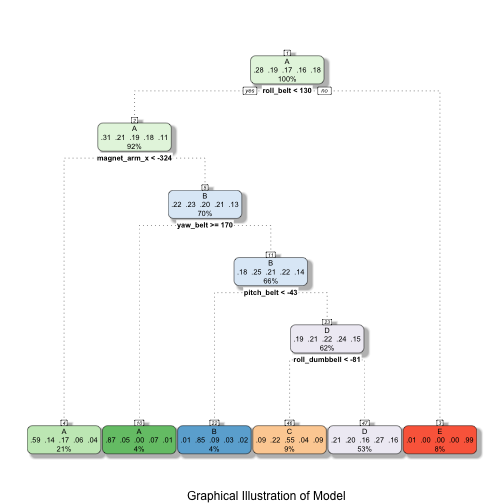

This is an R Markdown document to describe the work done on the Machine Learning course project.
## Data Cleaning and Exploration

One may gather the data by using the following block of code: 


```r
library(caret)
library(AppliedPredictiveModeling)
library(rattle)
library(rpart.plot)
library(corrplot)

trainURL <- "https://d396qusza40orc.cloudfront.net/predmachlearn/pml-training.csv"
testURL <- "https://d396qusza40orc.cloudfront.net/predmachlearn/pml-testing.csv"

traindest <- "train.csv"
download.file(trainURL, traindest, method = "curl")    
traindata <- read.csv(traindest, sep = ",")

testdest <- "test.csv"
download.file(testURL, testdest, method = "curl")    
testdata <- read.csv(testdest, sep = ",")
```

## Model building and Cross Validation

Given the discrete values in the classe variable, a random forest will be used to build the model. To be able to evaluate model efficacy, a training and a test set are to be developed to allow for an effective cross validation. I chose to use 70% of data for training, and 30% for validation.


```r
clean <- na.omit(traindata)
inTrain <- createDataPartition(traindata$classe, p = .7, list = FALSE)
trainMod <- traindata[inTrain,]
validMod <- traindata[-inTrain,]
```

It can be observed that many of the columns or sensor variables are not returning valid data. As such, a model should be developed only by valid data that may effectively influence the model and not increase the complexity unnecessarily.


```r
trainRF <- train(classe ~ accel_belt_x + accel_belt_y + magnet_arm_x + 
                  accel_belt_z + total_accel_arm + roll_dumbbell + pitch_dumbbell 
                  + yaw_dumbbell + roll_belt + pitch_belt + yaw_belt 
                  + total_accel_dumbbell +total_accel_forearm +total_accel_belt 
                 ,method="rpart",data=trainMod)
```

Upon creation of the model, it can then be viewed:


```r
fancyRpartPlot(trainRF$finalModel, sub = "Graphical Illustration of Model")
```

 

```r
# plot(trainRF$finalModel, uniform=T) 
# text(trainRF$finalModel, cex=0.8)
```

## Expected Error

Now that the model has been created, it can be checked for accuracy. In this case, let's use a confusion matrix and then assess overall model accuracy.


```r
validationTest <- predict(trainRF, validMod)
confusionMatrix(validationTest, validMod$classe)
```

```
## Confusion Matrix and Statistics
## 
##           Reference
## Prediction   A   B   C   D   E
##          A 941 193 204  64  48
##          B   3 185  16   7   4
##          C  59 126 283  19  59
##          D 666 635 523 874 473
##          E   5   0   0   0 498
## 
## Overall Statistics
##                                           
##                Accuracy : 0.4726          
##                  95% CI : (0.4597, 0.4854)
##     No Information Rate : 0.2845          
##     P-Value [Acc > NIR] : < 2.2e-16       
##                                           
##                   Kappa : 0.3429          
##  Mcnemar's Test P-Value : < 2.2e-16       
## 
## Statistics by Class:
## 
##                      Class: A Class: B Class: C Class: D Class: E
## Sensitivity            0.5621  0.16242  0.27583   0.9066  0.46026
## Specificity            0.8791  0.99368  0.94587   0.5332  0.99896
## Pos Pred Value         0.6490  0.86047  0.51832   0.2756  0.99006
## Neg Pred Value         0.8347  0.83175  0.86084   0.9668  0.89149
## Prevalence             0.2845  0.19354  0.17434   0.1638  0.18386
## Detection Rate         0.1599  0.03144  0.04809   0.1485  0.08462
## Detection Prevalence   0.2464  0.03653  0.09278   0.5388  0.08547
## Balanced Accuracy      0.7206  0.57805  0.61085   0.7199  0.72961
```

```r
validationPred <- predict(trainRF, testdata)
```

It can be observed that the model itself does not have a high degree of accuracy. This is likely due to two factors. First, the data should be cleaned more effectively and second, perhaps more input parameters should be used, or a different model should be used.
