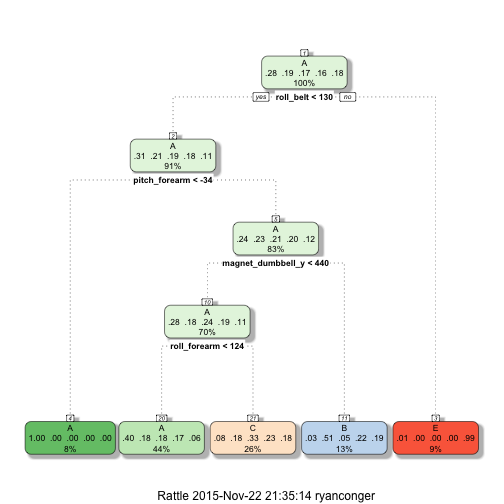
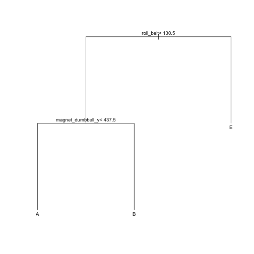

This is an R Markdown document to describe the work done on the Machine Learning course project.
## Data Cleaning and Exploration


## Model building


```r
na.omit(traindata)
```

```
##           X user_name raw_timestamp_part_1 raw_timestamp_part_2
## 24       24  carlitos           1323084232               996313
## 52       52  carlitos           1323084233               948290
## 76       76  carlitos           1323084234               984276
## 165     165  carlitos           1323084238               972281
## 210     210     pedro           1323094970               968279
## 241     241     pedro           1323094971               980388
## 314     314     pedro           1323094974               972294
## 401     401     pedro           1323094979               944324
## 463     463     pedro           1323094981               984324
## 476     476     pedro           1323094982               972372
## 506     506     pedro           1323094983               980467
## 532     532     pedro           1323094985               968336
## 552     552     pedro           1323094986               956365
## 581     581     pedro           1323094987               992372
## 598     598     pedro           1323094988               980340
## 645     645     pedro           1323094992               912282
## 749     749    adelmo           1322832774               956297
## 772     772    adelmo           1322832775               980342
## 832     832    adelmo           1322832778               988368
## 872     872    adelmo           1322832780               964384
## 893     893    adelmo           1322832781               568320
## 925     925   charles           1322837831               980319
## 947     947    adelmo           1322832782               952301
## 969     969    adelmo           1322832783               988309
## 1034   1034    adelmo           1322832785               992298
## 1076   1076    adelmo           1322832787               964287
## 1132   1132    adelmo           1322832789               960318
## 1253   1253    adelmo           1322832799               996289
## 1276   1276    adelmo           1322832800               988502
## 1318   1318    adelmo           1322832803               980436
## 1340   1340    adelmo           1322832804               984334
## 1435   1435    adelmo           1322832808               996286
## 1458   1458    adelmo           1322832809               968327
## 1532   1532    adelmo           1322832814               972383
## 1586   1586    adelmo           1322832816               972487
## 1620   1620    adelmo           1322832819               972285
## 1641   1641    eurico           1322489611               998640
## 1668   1668    eurico           1322489612               998673
## 1772   1772    eurico           1322489618               938647
## 1825   1825    eurico           1322489620               998648
## 1882   1882    eurico           1322489623               994694
## 1908   1908    eurico           1322489625               978640
## 1958   1958    eurico           1322489629               998694
## 1979   1979    eurico           1322489630               994783
## 2008   2008    eurico           1322489631               994678
## 2064   2064    eurico           1322489633               948414
## 2144   2144    eurico           1322489637               990660
## 2166   2166    eurico           1322489638               958691
## 2210   2210    eurico           1322489640               982646
## 2231   2231    jeremy           1322673025               998692
## 2255   2255    jeremy           1322673026               958649
## 2282   2282    jeremy           1322673027               942651
## 2314   2314    jeremy           1322673028               974714
## 2422   2422    jeremy           1322673032               982655
## 2449   2449    jeremy           1322673033               998716
## 2478   2478    jeremy           1322673034               994826
## 2505   2505    jeremy           1322673036               990648
## 2574   2574    jeremy           1322673039               946627
## 2675   2675  carlitos           1323084242               996343
## 2835   2835  carlitos           1323084248               988366
## 2908   2908  carlitos           1323084251               988364
## 2954   2954  carlitos           1323084253               956387
##         cvtd_timestamp new_window num_window roll_belt pitch_belt yaw_belt
## 24    05/12/2011 11:23        yes         12      1.51       8.10   -94.40
## 52    05/12/2011 11:23        yes         13      1.27       7.56   -94.10
## 76    05/12/2011 11:23        yes         14      1.18       7.26   -94.10
## 165   05/12/2011 11:23        yes         18      1.01       7.38   -93.80
## 210   05/12/2011 14:22        yes         47    129.00      27.90     2.35
## 241   05/12/2011 14:22        yes         48    128.00      27.80     1.52
## 314   05/12/2011 14:22        yes         51    124.00      27.60    -2.03
## 401   05/12/2011 14:22        yes         55    125.00      26.00    -2.08
## 463   05/12/2011 14:23        yes         57    124.00      25.50    -2.12
## 476   05/12/2011 14:23        yes         58    123.00      26.30    -3.45
## 506   05/12/2011 14:23        yes         59    123.00      26.00    -3.07
## 532   05/12/2011 14:23        yes         60    124.00      26.00    -2.40
## 552   05/12/2011 14:23        yes         61    123.00      26.10    -3.09
## 581   05/12/2011 14:23        yes         62    122.00      25.90    -3.98
## 598   05/12/2011 14:23        yes         63    123.00      25.70    -3.98
## 645   05/12/2011 14:23        yes         65    123.00      26.10    -3.45
## 749   02/12/2011 13:32        yes        176    129.00     -40.20   168.00
## 772   02/12/2011 13:32        yes        177    130.00     -39.60   165.00
## 832   02/12/2011 13:32        yes        180    129.00     -40.40   163.00
## 872   02/12/2011 13:33        yes        182    130.00     -39.60   161.00
## 893   02/12/2011 13:33        yes        183    129.00     -39.60   161.00
## 925   02/12/2011 14:57        yes        184    117.00      17.60    -3.67
## 947   02/12/2011 13:33        yes        186    126.00     -42.50   166.00
## 969   02/12/2011 13:33        yes        187    126.00     -41.30   164.00
## 1034  02/12/2011 13:33        yes        190    125.00     -44.50   170.00
## 1076  02/12/2011 13:33        yes        192    131.00     -42.30   162.00
## 1132  02/12/2011 13:33        yes        194    124.00     -41.70   163.00
## 1253  02/12/2011 13:33        yes        200    121.00     -43.50   172.00
## 1276  02/12/2011 13:33        yes        201    121.00     -43.80   173.00
## 1318  02/12/2011 13:33        yes        203    120.00     -44.00   174.00
## 1340  02/12/2011 13:33        yes        204    121.00     -43.70   173.00
## 1435  02/12/2011 13:33        yes        208    121.00     -44.00   174.00
## 1458  02/12/2011 13:33        yes        209    121.00     -43.90   174.00
## 1532  02/12/2011 13:33        yes        213    121.00     -44.00   173.00
## 1586  02/12/2011 13:33        yes        215    121.00     -43.70   172.00
## 1620  02/12/2011 13:33        yes        216    122.00     -43.30   172.00
## 1641  28/11/2011 14:13        yes        217      1.47       5.59   -87.80
## 1668  28/11/2011 14:13        yes        218      1.24       5.51   -87.80
## 1772  28/11/2011 14:13        yes        223      0.99       4.12   -87.60
## 1825  28/11/2011 14:13        yes        225      1.27       4.65   -87.80
## 1882  28/11/2011 14:13        yes        227      1.00       4.79   -87.60
## 1908  28/11/2011 14:13        yes        228      1.72       4.24   -87.30
## 1958  28/11/2011 14:13        yes        230      1.88       3.50   -87.60
## 1979  28/11/2011 14:13        yes        231      1.45       4.44   -87.80
## 2008  28/11/2011 14:13        yes        232      0.77       3.34   -87.80
## 2064  28/11/2011 14:13        yes        234      0.90       3.61   -88.30
## 2144  28/11/2011 14:13        yes        237      1.95       2.83   -88.80
## 2166  28/11/2011 14:13        yes        238      1.96       4.19   -88.90
## 2210  28/11/2011 14:14        yes        240      1.05       1.17   -88.90
## 2231  30/11/2011 17:10        yes        308      0.53       5.42   -88.00
## 2255  30/11/2011 17:10        yes        309      0.74       5.37   -87.90
## 2282  30/11/2011 17:10        yes        310      0.71       4.69   -87.90
## 2314  30/11/2011 17:10        yes        311      0.98       4.94   -87.80
## 2422  30/11/2011 17:10        yes        315      0.38       5.68   -88.30
## 2449  30/11/2011 17:10        yes        316      0.71       4.91   -88.00
## 2478  30/11/2011 17:10        yes        317      0.48       5.08   -88.00
## 2505  30/11/2011 17:10        yes        318      0.43       5.03   -88.10
## 2574  30/11/2011 17:10        yes        321      0.65       5.19   -88.00
## 2675  05/12/2011 11:24        yes        325      1.83       7.27   -94.00
## 2835  05/12/2011 11:24        yes        331      1.43       6.25   -93.70
## 2908  05/12/2011 11:24        yes        334      1.61       7.85   -93.70
## 2954  05/12/2011 11:24        yes        336      1.25       6.70   -93.70
##       total_accel_belt kurtosis_roll_belt kurtosis_picth_belt
## 24                   3           5.587755             #DIV/0!
## 52                   3          -0.997130             #DIV/0!
## 76                   3           7.515290             #DIV/0!
## 165                  4          -2.121212           -1.298590
## 210                 21          -1.122273           19.810708
## 241                 21          -0.668237            0.988872
## 314                 20          -0.684696           -0.605475
## 401                 20          -1.385691           44.000000
## 463                 20          -0.480396           -2.054174
## 476                 20          -1.374453           -0.405888
## 506                 19          -1.021178           -0.150950
## 532                 19          -1.022813            0.988872
## 552                 20           1.775249           -1.473052
## 581                 19          -1.227048           -0.386848
## 598                 20          -1.057741           -2.060105
## 645                 19          -1.536456           -2.060105
## 749                 19          -1.293601           20.819259
## 772                 19          -1.423943           40.000000
## 832                 18            #DIV/0!             #DIV/0!
## 872                 18            #DIV/0!           16.779401
## 893                 18           2.912541             #DIV/0!
## 925                 17          -1.540900            0.899480
## 947                 18           2.603688            1.488647
## 969                 17          -0.317284            7.120083
## 1034                18          -1.443997            1.563592
## 1076                19          -1.348439           -2.018250
## 1132                17          -0.526626             #DIV/0!
## 1253                18          -1.075175           -1.830899
## 1276                18          -1.736374           11.094417
## 1318                17          -1.961739             #DIV/0!
## 1340                17          -1.908453            7.259947
## 1435                18           0.201530            0.201530
## 1458                17          -2.108108           -0.591750
## 1532                18          -0.688262           -2.038222
## 1586                17          -0.330885            0.651320
## 1620                17          -1.402276           -1.480863
## 1641                 3          -1.087882            2.538390
## 1668                 3          -1.620136             #DIV/0!
## 1772                 3          -0.533999           -0.060755
## 1825                 3          -2.020370           13.124340
## 1882                 3           4.393964           58.000000
## 1908                 3          -0.559214            8.063736
## 1958                 2          -0.263059            1.326417
## 1979                 2          -0.551353            4.152848
## 2008                 3           2.304744           -1.146729
## 2064                 3          -0.060755           -2.078006
## 2144                 2          -0.999965            1.326417
## 2166                 2          -0.532633           -1.736374
## 2210                 3          -1.468165           -0.903271
## 2231                 5            #DIV/0!             #DIV/0!
## 2255                 5          -0.487458           12.786550
## 2282                 4          -2.090909            0.651320
## 2314                 4          -0.420582            1.216445
## 2422                 5          21.000000            2.777851
## 2449                 5          -1.353727           22.330729
## 2478                 5           2.488644            2.488644
## 2505                 5          -2.040420            1.502757
## 2574                 5           0.120005             #DIV/0!
## 2675                 3          -1.121477            2.949202
## 2835                 3          -1.249047            1.216445
## 2908                 3          -0.210458            5.791962
## 2954                 4          -1.211136           47.000000
##       kurtosis_yaw_belt skewness_roll_belt skewness_roll_belt.1
## 24              #DIV/0!           2.713152              #DIV/0!
## 52              #DIV/0!           0.007518              #DIV/0!
## 76              #DIV/0!          -3.031527              #DIV/0!
## 165             #DIV/0!           1.044014             0.881390
## 210             #DIV/0!          -0.177846            -4.575081
## 241             #DIV/0!          -0.638799            -1.717824
## 314             #DIV/0!          -0.847382             1.192288
## 401             #DIV/0!           0.216158            -6.633250
## 463             #DIV/0!          -0.207718            -0.152835
## 476             #DIV/0!           0.260148            -0.796589
## 506             #DIV/0!          -0.263336            -1.362688
## 532             #DIV/0!           0.338703            -1.717824
## 552             #DIV/0!          -1.561715            -0.776700
## 581             #DIV/0!           0.487345             1.276157
## 598             #DIV/0!           0.000748             0.189082
## 645             #DIV/0!          -0.244053            -0.189082
## 749             #DIV/0!           0.187107            -4.683414
## 772             #DIV/0!           0.097898            -6.324555
## 832             #DIV/0!            #DIV/0!              #DIV/0!
## 872             #DIV/0!            #DIV/0!             4.233256
## 893             #DIV/0!          -2.180288              #DIV/0!
## 925             #DIV/0!           0.397334            -0.924710
## 947             #DIV/0!           1.918416             0.290885
## 969             #DIV/0!           0.679307             2.059648
## 1034            #DIV/0!           0.398721            -0.369243
## 1076            #DIV/0!           0.009774             0.260179
## 1132            #DIV/0!           0.213506              #DIV/0!
## 1253            #DIV/0!           0.000000             0.508639
## 1276            #DIV/0!          -0.587156             3.548480
## 1318            #DIV/0!           0.349066              #DIV/0!
## 1340            #DIV/0!           0.422463             2.989812
## 1435            #DIV/0!           1.481339             1.481339
## 1458            #DIV/0!           0.000000             1.200185
## 1532            #DIV/0!           1.160174             0.242696
## 1586            #DIV/0!           1.298099             1.620318
## 1620            #DIV/0!          -0.374465             0.760030
## 1641            #DIV/0!           0.978908             2.106276
## 1668            #DIV/0!           0.666133              #DIV/0!
## 1772            #DIV/0!          -0.226073            -1.394027
## 1825            #DIV/0!          -0.249289            -3.821069
## 1882            #DIV/0!           0.867969            -7.615773
## 1908            #DIV/0!          -1.041509            -1.554700
## 1958            #DIV/0!           0.000000            -1.810464
## 1979            #DIV/0!           0.249636            -2.440735
## 2008            #DIV/0!          -0.083956            -0.946756
## 2064            #DIV/0!           1.394027            -0.082562
## 2144            #DIV/0!          -0.167575            -1.810464
## 2166            #DIV/0!           0.091187            -0.587156
## 2210            #DIV/0!           0.113970            -0.514406
## 2231            #DIV/0!            #DIV/0!              #DIV/0!
## 2255            #DIV/0!           0.185095            -3.777024
## 2282            #DIV/0!           1.033274            -1.620318
## 2314            #DIV/0!           1.264775            -1.779168
## 2422            #DIV/0!           0.000000            -2.156553
## 2449            #DIV/0!           0.479629            -4.841323
## 2478            #DIV/0!           2.097857            -2.097857
## 2505            #DIV/0!          -0.203049            -1.049496
## 2574            #DIV/0!           1.454956              #DIV/0!
## 2675            #DIV/0!           0.148219             2.194794
## 2835            #DIV/0!           0.073993             1.779168
## 2908            #DIV/0!           0.354218             2.749860
## 2954            #DIV/0!           0.682173             6.855655
##       skewness_yaw_belt max_roll_belt max_picth_belt max_yaw_belt
## 24              #DIV/0!         -94.3              3          5.6
## 52              #DIV/0!         -94.1              3         -1.0
## 76              #DIV/0!         -94.1              3          7.5
## 165             #DIV/0!         -93.8              4         -2.1
## 210             #DIV/0!           2.4             21         -1.1
## 241             #DIV/0!           2.7             21         -0.7
## 314             #DIV/0!           1.2             21         -0.7
## 401             #DIV/0!          -0.7             20         -1.4
## 463             #DIV/0!          -1.5             20         -0.5
## 476             #DIV/0!          -2.1             20         -1.4
## 506             #DIV/0!          -3.1             20         -1.0
## 532             #DIV/0!          -2.4             20         -1.0
## 552             #DIV/0!          -1.9             20          1.8
## 581             #DIV/0!          -2.9             20         -1.2
## 598             #DIV/0!          -3.8             20         -1.1
## 645             #DIV/0!          -3.4             20         -1.5
## 749             #DIV/0!         177.0             19         -1.3
## 772             #DIV/0!         168.0             19         -1.4
## 832             #DIV/0!         163.0             18      #DIV/0!
## 872             #DIV/0!         161.0             19      #DIV/0!
## 893             #DIV/0!         161.0             18          2.9
## 925             #DIV/0!          -2.8             19         -1.5
## 947             #DIV/0!         166.0             19          2.6
## 969             #DIV/0!         166.0             20         -0.3
## 1034            #DIV/0!         170.0             19         -1.4
## 1076            #DIV/0!         163.0             19         -1.3
## 1132            #DIV/0!         163.0             17         -0.5
## 1253            #DIV/0!         173.0             18         -1.1
## 1276            #DIV/0!         173.0             18         -1.7
## 1318            #DIV/0!         174.0             17         -2.0
## 1340            #DIV/0!         174.0             18         -1.9
## 1435            #DIV/0!         174.0             18          0.2
## 1458            #DIV/0!         174.0             18         -2.1
## 1532            #DIV/0!         174.0             18         -0.7
## 1586            #DIV/0!         173.0             18         -0.3
## 1620            #DIV/0!         173.0             18         -1.4
## 1641            #DIV/0!         -87.7              4         -1.1
## 1668            #DIV/0!         -87.7              3         -1.6
## 1772            #DIV/0!         -87.3              3         -0.5
## 1825            #DIV/0!         -87.7              3         -2.0
## 1882            #DIV/0!         -87.5              3          4.4
## 1908            #DIV/0!         -87.3              4         -0.6
## 1958            #DIV/0!         -87.6              3         -0.3
## 1979            #DIV/0!         -87.6              3         -0.6
## 2008            #DIV/0!         -87.6              3          2.3
## 2064            #DIV/0!         -88.2              3         -0.1
## 2144            #DIV/0!         -88.8              3         -1.0
## 2166            #DIV/0!         -88.6              3         -0.5
## 2210            #DIV/0!         -88.8              3         -1.5
## 2231            #DIV/0!         -88.0              5      #DIV/0!
## 2255            #DIV/0!         -87.8              5         -0.5
## 2282            #DIV/0!         -87.9              5         -2.1
## 2314            #DIV/0!         -87.8              5         -0.4
## 2422            #DIV/0!         -88.2              5         21.0
## 2449            #DIV/0!         -88.0              5         -1.4
## 2478            #DIV/0!         -87.9              5          2.5
## 2505            #DIV/0!         -88.0              6         -2.0
## 2574            #DIV/0!         -87.9              5          0.1
## 2675            #DIV/0!         -93.9              4         -1.1
## 2835            #DIV/0!         -93.4              4         -1.2
## 2908            #DIV/0!         -93.5              4         -0.2
## 2954            #DIV/0!         -93.5              4         -1.2
##       min_roll_belt min_pitch_belt min_yaw_belt amplitude_roll_belt
## 24            -94.4              3          5.6                0.10
## 52            -94.4              3         -1.0                0.30
## 76            -94.2              3          7.5                0.10
## 165           -93.8              3         -2.1                0.00
## 210             0.8             20         -1.1                1.59
## 241             1.5             20         -0.7                1.17
## 314            -2.0             20         -0.7                3.23
## 401            -2.1             19         -1.4                1.34
## 463            -3.0             19         -0.5                1.48
## 476            -4.2             18         -1.4                2.18
## 506            -3.6             19         -1.0                0.50
## 532            -3.6             19         -1.0                1.29
## 552            -3.1             19          1.8                1.20
## 581            -4.0             19         -1.2                1.13
## 598            -4.6             19         -1.1                0.83
## 645            -4.1             19         -1.5                0.70
## 749           168.0             18         -1.3                9.00
## 772           165.0             18         -1.4                3.00
## 832           163.0             18      #DIV/0!                0.00
## 872           161.0             18      #DIV/0!                0.00
## 893           160.0             18          2.9                1.00
## 925            -3.8             17         -1.5                1.03
## 947           161.0             17          2.6                5.00
## 969           161.0             16         -0.3                5.00
## 1034          160.0             17         -1.4               10.00
## 1076          159.0             18         -1.3                4.00
## 1132          161.0             17         -0.5                2.00
## 1253          171.0             17         -1.1                2.00
## 1276          172.0             17         -1.7                1.00
## 1318          173.0             17         -2.0                1.00
## 1340          173.0             17         -1.9                1.00
## 1435          173.0             17          0.2                1.00
## 1458          173.0             17         -2.1                1.00
## 1532          173.0             17         -0.7                1.00
## 1586          172.0             17         -0.3                1.00
## 1620          171.0             17         -1.4                2.00
## 1641          -87.8              3         -1.1                0.10
## 1668          -87.8              3         -1.6                0.10
## 1772          -87.8              2         -0.5                0.50
## 1825          -87.8              2         -2.0                0.10
## 1882          -87.7              2          4.4                0.20
## 1908          -87.6              2         -0.6                0.30
## 1958          -87.8              2         -0.3                0.20
## 1979          -87.8              2         -0.6                0.20
## 2008          -87.8              2          2.3                0.20
## 2064          -88.3              2         -0.1                0.10
## 2144          -89.1              2         -1.0                0.30
## 2166          -88.9              2         -0.5                0.30
## 2210          -89.5              1         -1.5                0.70
## 2231          -88.0              5      #DIV/0!                0.00
## 2255          -88.0              4         -0.5                0.20
## 2282          -87.9              4         -2.1                0.00
## 2314          -87.9              4         -0.4                0.10
## 2422          -88.4              4         21.0                0.20
## 2449          -88.2              4         -1.4                0.20
## 2478          -88.0              4          2.5                0.10
## 2505          -88.1              4         -2.0                0.10
## 2574          -88.0              5          0.1                0.10
## 2675          -94.1              3         -1.1                0.20
## 2835          -93.8              3         -1.2                0.40
## 2908          -93.8              3         -0.2                0.30
## 2954          -93.8              3         -1.2                0.30
##       amplitude_pitch_belt amplitude_yaw_belt var_total_accel_belt
## 24                       0             0.0000               0.0000
## 52                       0             0.0000               0.0000
## 76                       0             0.0000               0.0000
## 165                      1             0.0000               0.2000
## 210                      1             0.0000               0.0000
## 241                      1             0.0000               0.2000
## 314                      1             0.0000               0.2000
## 401                      1             0.0000               0.0000
## 463                      1             0.0000               0.3000
## 476                      2             0.0000               0.3000
## 506                      1             0.0000               0.2000
## 532                      1             0.0000               0.2000
## 552                      1             0.0000               0.2000
## 581                      1             0.0000               0.2000
## 598                      1             0.0000               0.3000
## 645                      1             0.0000               0.3000
## 749                      1             0.0000               0.0000
## 772                      1             0.0000               0.0000
## 832                      0            #DIV/0!               0.0000
## 872                      1            #DIV/0!               0.0000
## 893                      0             0.0000               0.1000
## 925                      2             0.0000               0.2000
## 947                      2             0.0000               0.2000
## 969                      4             0.0000               0.4000
## 1034                     2             0.0000               0.2000
## 1076                     1             0.0000               0.3000
## 1132                     0             0.0000               0.0000
## 1253                     1             0.0000               0.2000
## 1276                     1             0.0000               0.1000
## 1318                     0             0.0000               0.0000
## 1340                     1             0.0000               0.1000
## 1435                     1             0.0000               0.2000
## 1458                     1             0.0000               0.2000
## 1532                     1             0.0000               0.3000
## 1586                     1             0.0000               0.2000
## 1620                     1             0.0000               0.2000
## 1641                     1             0.0000               0.1000
## 1668                     0             0.0000               0.0000
## 1772                     1             0.0000               0.2000
## 1825                     1             0.0000               0.1000
## 1882                     1             0.0000               0.0000
## 1908                     2             0.0000               0.1000
## 1958                     1             0.0000               0.1000
## 1979                     1             0.0000               0.1000
## 2008                     1             0.0000               0.2000
## 2064                     1             0.0000               0.3000
## 2144                     1             0.0000               0.1000
## 2166                     1             0.0000               0.2000
## 2210                     2             0.0000               0.3000
## 2231                     0            #DIV/0!               0.0000
## 2255                     1             0.0000               0.1000
## 2282                     1             0.0000               0.2000
## 2314                     1             0.0000               0.1000
## 2422                     1             0.0000               0.1000
## 2449                     1             0.0000               0.0000
## 2478                     1             0.0000               0.1000
## 2505                     2             0.0000               0.2000
## 2574                     0             0.0000               0.0000
## 2675                     1             0.0000               0.1000
## 2835                     1             0.0000               0.1000
## 2908                     1             0.0000               0.1000
## 2954                     1             0.0000               0.0000
##       avg_roll_belt stddev_roll_belt var_roll_belt avg_pitch_belt
## 24           1.5000           0.1000        0.0000         8.1000
## 52           1.4000           0.1000        0.0000         7.9000
## 76           1.2000           0.0000        0.0000         7.4000
## 165          1.0000           0.1000        0.0000         7.1000
## 210        128.9000           0.3000        0.1000        28.1000
## 241        128.9000           0.3000        0.1000        27.9000
## 314        126.2000           0.8000        0.6000        27.4000
## 401        124.8000           0.4000        0.2000        25.7000
## 463        123.6000           0.5000        0.2000        26.0000
## 476        123.3000           0.7000        0.4000        26.3000
## 506        123.7000           0.4000        0.2000        26.2000
## 532        124.0000           0.0000        0.0000        26.4000
## 552        123.9000           0.4000        0.1000        25.8000
## 581        122.3000           0.5000        0.2000        26.0000
## 598        122.5000           0.5000        0.3000        25.9000
## 645        123.0000           0.2000        0.0000        26.1000
## 749        127.6000           1.1000        1.3000       -41.5000
## 772        129.8000           0.4000        0.2000       -39.9000
## 832        129.0000           0.0000        0.0000       -40.4000
## 872        129.5000           0.5000        0.3000       -39.8000
## 893        129.2000           0.4000        0.2000       -39.6000
## 925        117.8000           0.8000        0.6000        17.6000
## 947        128.4000           1.0000        1.0000       -40.1000
## 969        126.2000           0.6000        0.3000       -41.3000
## 1034       126.8000           1.3000        1.8000       -41.9000
## 1076       129.6000           1.1000        1.3000       -41.7000
## 1132       124.9000           0.3000        0.1000       -41.3000
## 1253       121.2000           0.4000        0.1000       -43.6000
## 1276       121.0000           0.0000        0.0000       -43.6000
## 1318       120.3000           0.5000        0.2000       -43.7000
## 1340       120.5000           0.5000        0.3000       -43.8000
## 1435       121.0000           0.0000        0.0000       -43.8000
## 1458       121.0000           0.0000        0.0000       -43.9000
## 1532       121.1000           0.4000        0.1000       -43.9000
## 1586       121.1000           0.4000        0.1000       -43.6000
## 1620       121.5000           0.5000        0.3000       -43.6000
## 1641         1.3000           0.2000        0.1000         5.2000
## 1668         1.6000           0.2000        0.0000         5.1000
## 1772         1.6000           0.4000        0.1000         3.6000
## 1825         1.2000           0.2000        0.1000         4.5000
## 1882         1.5000           0.4000        0.1000         4.5000
## 1908         1.3000           0.3000        0.1000         4.1000
## 1958         1.4000           0.3000        0.1000         4.0000
## 1979         1.2000           0.3000        0.1000         3.8000
## 2008         1.2000           0.4000        0.2000         2.9000
## 2064         1.5000           0.4000        0.2000         3.8000
## 2144         1.5000           0.2000        0.0000         3.6000
## 2166         1.6000           0.2000        0.0000         1.9000
## 2210         1.5000           0.5000        0.2000         3.7000
## 2231         0.5000           0.0000        0.0000         5.4000
## 2255         0.7000           0.1000        0.0000         5.4000
## 2282         0.7000           0.1000        0.0000         5.0000
## 2314         0.8000           0.1000        0.0000         4.9000
## 2422         0.5000           0.1000        0.0000         5.7000
## 2449         0.5000           0.1000        0.0000         5.6000
## 2478         0.7000           0.2000        0.0000         4.9000
## 2505         0.5000           0.1000        0.0000         5.3000
## 2574         0.6000           0.1000        0.0000         5.2000
## 2675         1.7000           0.1000        0.0000         7.7000
## 2835         1.0000           0.2000        0.1000         7.2000
## 2908         1.6000           0.1000        0.0000         7.3000
## 2954         1.3000           0.1000        0.0000         7.0000
##       stddev_pitch_belt var_pitch_belt avg_yaw_belt stddev_yaw_belt
## 24               0.0000         0.0000     -94.4000          0.0000
## 52               0.2000         0.0000     -94.3000          0.1000
## 76               0.1000         0.0000     -94.1000          0.0000
## 165              0.1000         0.0000     -93.8000          0.0000
## 210              0.2000         0.0000       1.7000          0.5000
## 241              0.1000         0.0000       2.3000          0.3000
## 314              0.3000         0.1000       0.1000          1.0000
## 401              0.2000         0.0000      -1.4000          0.4000
## 463              0.2000         0.1000      -2.3000          0.4000
## 476              0.4000         0.2000      -3.2000          0.7000
## 506              0.1000         0.0000      -3.3000          0.1000
## 532              0.3000         0.1000      -3.1000          0.4000
## 552              0.2000         0.0000      -2.2000          0.3000
## 581              0.2000         0.0000      -3.5000          0.4000
## 598              0.2000         0.0000      -4.2000          0.3000
## 645              0.1000         0.0000      -3.7000          0.3000
## 749              1.0000         1.0000     172.2000          2.8000
## 772              0.3000         0.1000     166.4000          1.2000
## 832              0.1000         0.0000     163.0000          0.0000
## 872              0.2000         0.0000     161.0000          0.0000
## 893              0.2000         0.0000     160.9000          0.3000
## 925              0.2000         0.0000      -3.3000          0.4000
## 947              0.8000         0.6000     161.8000          1.4000
## 969              0.6000         0.4000     163.2000          1.5000
## 1034             1.8000         3.3000     164.3000          3.8000
## 1076             1.2000         1.4000     160.6000          1.3000
## 1132             0.3000         0.1000     161.7000          0.6000
## 1253             0.2000         0.0000     172.0000          0.7000
## 1276             0.1000         0.0000     172.6000          0.5000
## 1318             0.1000         0.0000     173.4000          0.5000
## 1340             0.1000         0.0000     173.4000          0.5000
## 1435             0.1000         0.0000     173.2000          0.4000
## 1458             0.0000         0.0000     173.5000          0.5000
## 1532             0.1000         0.0000     173.3000          0.4000
## 1586             0.1000         0.0000     172.2000          0.4000
## 1620             0.3000         0.1000     172.2000          0.8000
## 1641             0.4000         0.1000     -87.8000          0.0000
## 1668             0.3000         0.1000     -87.8000          0.0000
## 1772             0.4000         0.2000     -87.5000          0.1000
## 1825             0.4000         0.2000     -87.7000          0.1000
## 1882             0.3000         0.1000     -87.6000          0.0000
## 1908             0.4000         0.1000     -87.4000          0.1000
## 1958             0.4000         0.2000     -87.7000          0.1000
## 1979             0.5000         0.3000     -87.7000          0.1000
## 2008             0.6000         0.3000     -87.7000          0.0000
## 2064             0.5000         0.2000     -88.3000          0.0000
## 2144             0.3000         0.1000     -88.9000          0.1000
## 2166             0.9000         0.8000     -88.7000          0.1000
## 2210             1.2000         1.5000     -89.2000          0.2000
## 2231             0.0000         0.0000     -88.0000          0.0000
## 2255             0.1000         0.0000     -87.9000          0.1000
## 2282             0.2000         0.1000     -87.9000          0.0000
## 2314             0.1000         0.0000     -87.9000          0.0000
## 2422             0.1000         0.0000     -88.3000          0.0000
## 2449             0.3000         0.1000     -88.1000          0.1000
## 2478             0.1000         0.0000     -88.0000          0.0000
## 2505             0.2000         0.0000     -88.0000          0.1000
## 2574             0.0000         0.0000     -88.0000          0.0000
## 2675             0.2000         0.1000     -94.0000          0.1000
## 2835             0.5000         0.2000     -93.6000          0.1000
## 2908             0.4000         0.2000     -93.7000          0.1000
## 2954             0.3000         0.1000     -93.7000          0.1000
##       var_yaw_belt gyros_belt_x gyros_belt_y gyros_belt_z accel_belt_x
## 24          0.0000         0.02         0.00        -0.02          -20
## 52          0.0100         0.00         0.00        -0.03          -19
## 76          0.0000         0.02         0.00        -0.03          -20
## 165         0.0000         0.03         0.00        -0.02          -19
## 210         0.2400        -0.43        -0.03        -0.44          -48
## 241         0.1200        -0.47        -0.02        -0.48          -43
## 314         1.0600        -0.50        -0.02        -0.51          -37
## 401         0.1700        -0.53        -0.02        -0.49          -42
## 463         0.1400        -0.39        -0.03        -0.43          -44
## 476         0.5500        -0.37        -0.05        -0.41          -44
## 506         0.0200        -0.39        -0.03        -0.43          -41
## 532         0.1500        -0.42        -0.03        -0.46          -38
## 552         0.1000        -0.53        -0.02        -0.48          -38
## 581         0.1500        -0.43        -0.03        -0.43          -44
## 598         0.0700        -0.51        -0.02        -0.46          -43
## 645         0.0600        -0.45        -0.02        -0.44          -41
## 749         8.0500         0.10         0.11        -0.18           47
## 772         1.3200         0.13         0.11        -0.16           47
## 832         0.0000         0.11         0.11        -0.18           44
## 872         0.0000         0.06         0.10        -0.20           48
## 893         0.0900         0.18         0.11        -0.16           45
## 925         0.1400         0.10         0.13        -0.16          -26
## 947         2.0900         0.39         0.18         0.03           15
## 969         2.2200         0.10         0.10        -0.16           49
## 1034       14.7800         0.08         0.13        -0.13           51
## 1076        1.6400         0.00         0.05        -0.25           25
## 1132        0.3800         0.16         0.13        -0.13           48
## 1253        0.5400         0.08         0.11        -0.23           47
## 1276        0.2400         0.13         0.11        -0.15           47
## 1318        0.2500         0.13         0.11        -0.15           48
## 1340        0.2500         0.13         0.11        -0.16           47
## 1435        0.1700         0.08         0.11        -0.16           45
## 1458        0.2600         0.13         0.11        -0.16           47
## 1532        0.1900         0.11         0.11        -0.18           47
## 1586        0.1800         0.14         0.11        -0.13           48
## 1620        0.6700         0.14         0.11        -0.15           48
## 1641        0.0000         0.00         0.02         0.00          -13
## 1668        0.0000         0.08        -0.02        -0.03          -11
## 1772        0.0200         0.06        -0.02        -0.03          -11
## 1825        0.0000         0.03         0.00        -0.05          -13
## 1882        0.0000         0.03         0.00        -0.02           -9
## 1908        0.0100        -0.05         0.02         0.02          -11
## 1958        0.0000         0.00         0.00        -0.02           -9
## 1979        0.0000        -0.05         0.00         0.02          -10
## 2008        0.0000         0.02         0.00         0.00          -10
## 2064        0.0000         0.03         0.00        -0.05           -8
## 2144        0.0100        -0.13         0.03         0.00           -7
## 2166        0.0100         0.19        -0.02         0.02           -7
## 2210        0.0600        -0.13        -0.02        -0.08           -4
## 2231        0.0000         0.02         0.00         0.00          -16
## 2255        0.0000         0.02        -0.02        -0.02          -14
## 2282        0.0000         0.02         0.00         0.02          -13
## 2314        0.0000         0.02         0.00         0.00          -13
## 2422        0.0000         0.05         0.00         0.00          -16
## 2449        0.0100         0.00         0.02         0.02          -15
## 2478        0.0000         0.02         0.00         0.00          -15
## 2505        0.0000         0.00        -0.02        -0.05          -15
## 2574        0.0000         0.03         0.02         0.00          -20
## 2675        0.0100        -0.02         0.02        -0.02          -17
## 2835        0.0200        -0.02         0.00         0.02          -20
## 2908        0.0000         0.00         0.00        -0.02          -20
## 2954        0.0100         0.05         0.02        -0.02          -18
##       accel_belt_y accel_belt_z magnet_belt_x magnet_belt_y magnet_belt_z
## 24               4           22            -3           601          -318
## 52               4           21             0           601          -312
## 76               3           22            -8           602          -309
## 165              2           29             0           612          -303
## 210             71         -186             6           567          -395
## 241             69         -187             3           566          -401
## 314             69         -175            -6           578          -372
## 401             72         -179             4           570          -381
## 463             70         -178            11           582          -376
## 476             72         -172             2           587          -373
## 506             69         -173             0           581          -381
## 532             69         -171             8           578          -375
## 552             69         -175             8           583          -371
## 581             67         -171             6           581          -370
## 598             71         -180            10           581          -362
## 645             71         -171             1           585          -362
## 749             44         -173           184           593          -362
## 772             45         -174           182           592          -350
## 832             45         -164           185           599          -348
## 872             46         -168           173           599          -339
## 893             44         -162           171           604          -343
## 925             63         -157            19           601          -330
## 947             59         -161           190           606          -337
## 969             42         -155           186           606          -315
## 1034            45         -160           197           587          -341
## 1076            47         -174           167           604          -356
## 1132            45         -152           165           616          -295
## 1253            46         -159           167           610          -300
## 1276            45         -159           167           610          -304
## 1318            43         -156           166           611          -303
## 1340            44         -158           162           608          -305
## 1435            45         -160           169           606          -295
## 1458            45         -157           170           605          -296
## 1532            47         -159           169           604          -303
## 1586            43         -154           169           614          -301
## 1620            45         -157           168           613          -292
## 1641             2           29            62           572          -406
## 1668             2           30            60           573          -425
## 1772             3           28            57           566          -409
## 1825             5           27            57           576          -424
## 1882             1           28            56           570          -423
## 1908             3           25            62           567          -419
## 1958             4           20            45           572          -435
## 1979             2           21            52           573          -431
## 2008             2           30            41           572          -417
## 2064             4           25            46           570          -426
## 2144             2           20            33           566          -420
## 2166             3           17            34           570          -441
## 2210             3           28            23           566          -440
## 2231             2           45            51           635          -299
## 2255             5           42            49           635          -302
## 2282             2           42            50           631          -312
## 2314             2           42            56           636          -306
## 2422             1           46            52           635          -303
## 2449             4           47            54           630          -309
## 2478             3           44            46           630          -297
## 2505            -4           46            49           635          -303
## 2574             0           47            56           637          -309
## 2675             2           19             2           601          -307
## 2835             5           19            -2           600          -296
## 2908             9           19            -3           602          -307
## 2954            -1           33            -2           606          -302
##       roll_arm pitch_arm yaw_arm total_accel_arm var_accel_arm
## 24     -129.00     20.70 -161.00              34        0.0000
## 52     -130.00     19.40 -162.00              34        0.0000
## 76     -131.00     18.10 -162.00              34        0.0000
## 165    -135.00     13.80 -165.00              34        0.0278
## 210      -8.60     15.40   10.00               3       21.0222
## 241      -1.12     -3.96  -63.30               3        0.1616
## 314    -160.00    -69.00   32.60              36       25.4043
## 401     148.00    -12.70   31.10              34       30.1839
## 463     132.00     20.40  -11.10              47      178.5063
## 476     146.00     -2.52   74.20              20       68.3258
## 506     132.00     13.30   69.30              22       22.4906
## 532     152.00     33.30   99.30              19       26.3629
## 552      80.80     55.10   -2.18              38       70.7788
## 581    -176.00     38.70  141.00              15       88.7071
## 598      23.60     54.30  -25.90              38       88.3018
## 645     -39.00     17.20  -44.20              30       55.4630
## 749     -91.30     35.70  103.00              22        0.6809
## 772     -63.40     15.00  104.00              25        0.9942
## 832      51.30     37.40  120.00              29        0.0000
## 872    -175.00     72.70  154.00              29        0.0000
## 893    -110.00     54.50 -169.00              29        0.2946
## 925     -84.40     -5.39  -12.20              17       67.8149
## 947     -75.90     23.20 -149.00              28        0.0233
## 969     -42.90      5.66 -128.00              25        1.3833
## 1034     27.50     18.50 -142.00              25        0.0587
## 1076    104.00     68.70  143.00              26        0.4215
## 1132    -87.70     42.00 -138.00              24        0.4568
## 1253      6.68     73.30  -36.10              23       19.9419
## 1276    -81.10     66.40 -153.00              26        2.3060
## 1318    -96.60     79.80 -175.00              27       27.9570
## 1340    -11.90     14.10  -74.10              11       46.4364
## 1435    -11.80    -22.10  -43.80              27       32.6788
## 1458      8.87     12.40  -36.00               5       59.1051
## 1532      5.50     51.50  -68.80              23        2.0664
## 1586     35.10     41.90   -7.48              16       77.7669
## 1620     41.30    -19.40  -10.30              12       12.8974
## 1641     77.00     42.90   91.10              29        0.9430
## 1668     75.10     43.00   88.50              29        0.1584
## 1772     73.40     44.70   87.30              30        0.1735
## 1825     72.60    -51.30  -19.10              32       97.4694
## 1882     69.30    -40.80   17.40              20      122.1948
## 1908     95.10    -47.90  -19.20              28       40.6936
## 1958     85.40     15.60  101.00              32       75.3476
## 1979     69.20    -18.90   66.50              18       14.3740
## 2008     77.20    -21.50   46.90              18      111.4061
## 2064    122.00    -35.30  -43.60              40      115.2657
## 2144     80.10     10.30  110.00              30       34.8657
## 2166    128.00    -35.50  -46.20              42      113.8113
## 2210    119.00    -39.50  -28.20              31       30.5700
## 2231      0.00      0.00    0.00              38        0.1897
## 2255      0.00      0.00    0.00              41        0.4626
## 2282      0.00      0.00    0.00              38        1.0916
## 2314      0.00      0.00    0.00              38        0.2478
## 2422      0.00      0.00    0.00              38        0.0454
## 2449      0.00      0.00    0.00              38        0.0200
## 2478      0.00      0.00    0.00              38        0.0179
## 2505      0.00      0.00    0.00              38        0.0565
## 2574      0.00      0.00    0.00              37        0.1810
## 2675   -139.00      8.58 -168.00              34        0.0000
## 2835   -144.00      1.66 -174.00              34        0.0000
## 2908   -158.00     56.80 -161.00              10       46.1506
## 2954     75.70     62.80   58.50              16       75.4635
##       avg_roll_arm stddev_roll_arm var_roll_arm avg_pitch_arm
## 24       -128.4898          0.5051       0.2551       21.4327
## 52       -129.6863          0.4686       0.2196       20.0451
## 76       -130.7826          0.4170       0.1739       18.7435
## 165      -134.9444          0.2323       0.0540       14.0083
## 210      -166.5869         34.4585    1187.3854       -7.1253
## 241        -4.3070          2.1189       4.4897        2.9778
## 314      -137.2604         26.1046     681.4501      -54.6667
## 401       144.6136          6.7349      45.3589      -11.7236
## 463       121.5741         11.7980     139.1925      -10.9020
## 476       141.5405          5.5707      31.0330       11.5608
## 506       138.5102          3.5126      12.3384       -6.2506
## 532       160.7800          4.0421      16.3384       14.0990
## 552        94.8950         28.7560     826.9077       46.1200
## 581       -24.3709        161.4515   26066.5754       40.0309
## 598        35.0659         93.5590    8753.2832       54.6023
## 645       -72.5273         17.4955     306.0923       32.6318
## 749      -112.6957         13.9287     194.0095       48.4830
## 772       -77.6075          8.2779      68.5238       24.5125
## 832        34.7891          9.9828      99.6565       25.0935
## 872       113.6308         73.0390    5334.6911       70.7026
## 893      -124.0189         20.1823     407.3266       59.4453
## 925       -80.3078         11.4800     131.7895      -16.4449
## 947       -89.2605          7.9034      62.4634       34.6860
## 969       -59.3820          9.3664      87.7289       13.3562
## 1034        9.6276         10.9556     120.0253        9.5557
## 1076       76.3500         12.9076     166.6072       55.0250
## 1132     -112.9737         17.8541     318.7677       55.8702
## 1253        8.7402          2.4055       5.7863       28.5114
## 1276      -68.5280         31.2373     975.7700       75.6591
## 1318      -14.1967         44.4860    1979.0056       69.6479
## 1340      -57.2800         36.2993    1317.6385       59.1489
## 1435      -33.1372         31.8921    1017.1086       30.5030
## 1458        6.8740          8.3090      69.0401      -13.0170
## 1532        4.9523          7.5745      57.3732       68.9884
## 1586       30.5277          4.4904      20.1638      -14.0717
## 1620       28.1162         14.0261     196.7316      -37.2596
## 1641       77.5061          0.6342       0.4023       41.0102
## 1668       76.2481          0.6261       0.3920       43.1462
## 1772       71.6680          0.7906       0.6251       43.5920
## 1825       63.0100         19.2341     369.9519      -24.7652
## 1882       90.0138         28.0168     784.9433      -43.0617
## 1908       69.7870          8.2789      68.5404       -2.5665
## 1958       94.0547         18.3080     335.1829      -20.0008
## 1979       79.7048          6.2334      38.8551        8.6607
## 2008       98.6582         18.0534     325.9251      -35.1091
## 2064       91.3820         23.5628     555.2048      -25.5830
## 2144       80.2075          4.1659      17.3546        0.3608
## 2166       92.2136         22.4135     502.3654      -25.1386
## 2210       86.5239         10.9552     120.0174      -14.1285
## 2231        0.0000          0.0000       0.0000        0.0000
## 2255        0.0000          0.0000       0.0000        0.0000
## 2282        0.0000          0.0000       0.0000        0.0000
## 2314        0.0000          0.0000       0.0000        0.0000
## 2422        0.0000          0.0000       0.0000        0.0000
## 2449        0.0000          0.0000       0.0000        0.0000
## 2478        0.0000          0.0000       0.0000        0.0000
## 2505        0.0000          0.0000       0.0000        0.0000
## 2574        0.0000          0.0000       0.0000        0.0000
## 2675     -138.1818          0.3902       0.1522        9.1755
## 2835     -143.6087          0.4934       0.2435        1.8211
## 2908     -151.6200          4.6943      22.0363       16.5242
## 2954       38.4064         17.0346     290.1776       33.1170
##       stddev_pitch_arm var_pitch_arm avg_yaw_arm stddev_yaw_arm
## 24              0.4836        0.2339   -161.0000         0.0000
## 52              0.4491        0.2017   -161.5882         0.4971
## 76              0.3716        0.1381   -162.0000         0.0000
## 165             0.2209        0.0488   -164.6389         0.4871
## 210             5.0294       25.2946    137.9933        27.8577
## 241             5.7029       32.5229    -25.0718        21.5283
## 314            15.0704      227.1180     11.3142        26.7693
## 401            12.4996      156.2395     17.8416        16.8559
## 463            16.0536      257.7193     61.9883        47.0096
## 476             8.0267       64.4277     29.0589        27.7863
## 506             7.5241       56.6116     97.6898        12.9377
## 532             9.7468       95.0007    106.3040        15.2213
## 552             5.9083       34.9083     18.6505        39.8230
## 581            17.2462      297.4318    106.4673        42.7052
## 598            15.2323      232.0230     29.4498        68.4248
## 645             5.0481       25.4836   -105.7773        30.2326
## 749             7.6647       58.7475     86.0723        11.0668
## 772             6.4542       41.6565    105.1500         0.6998
## 832             6.8777       47.3033    140.8913         9.4686
## 872             2.9423        8.6571    118.8462        17.9521
## 893             8.2709       68.4071    -67.6792       158.0789
## 925             7.7127       59.4863    -78.9784        35.9105
## 947             7.1337       50.8903   -158.0930         5.1861
## 969             4.8876       23.8886   -137.4600         7.0050
## 1034            4.5520       20.7205   -133.3673         2.8482
## 1076            7.9299       62.8828    150.4583         9.0294
## 1132            8.7266       76.1528   -143.2456         3.6998
## 1253           28.2663      798.9864    -14.8124         9.5912
## 1276            5.5858       31.2011   -131.3659        39.5728
## 1318           16.6741      278.0264    -74.4188        54.1188
## 1340           19.0989      364.7680    -47.6133       133.5623
## 1435           34.7850     1209.9995    -71.3256        66.6456
## 1458           10.5618      111.5513    -37.8325         2.6452
## 1532            5.5820       31.1587    -67.4047        12.0910
## 1586           30.9512      957.9789    -20.6794         9.9423
## 1620            7.0813       50.1452    -26.2423         4.7765
## 1641            1.2700        1.6130     92.8469         1.7343
## 1668            0.1350        0.0182     89.6712         0.6824
## 1772            0.5306        0.2816     85.0140         0.9114
## 1825           32.2547     1040.3643     10.9462        40.4513
## 1882           13.0917      171.3937    -17.0762        41.1160
## 1908           25.8214      666.7429     68.6267        36.2614
## 1958           20.8903      436.4027     22.9243        53.4879
## 1979           10.7703      115.9988    101.1762        13.0111
## 2008            5.4239       29.4182     -2.9502        35.6428
## 2064           16.4229      269.7106     24.1620        59.9458
## 2144           16.7413      280.2710     88.0623        30.5309
## 2166           16.8127      282.6664     24.7766        56.6308
## 2210           21.0233      441.9808     62.2548        44.6052
## 2231            0.0000        0.0000      0.0000         0.0000
## 2255            0.0000        0.0000      0.0000         0.0000
## 2282            0.0000        0.0000      0.0000         0.0000
## 2314            0.0000        0.0000      0.0000         0.0000
## 2422            0.0000        0.0000      0.0000         0.0000
## 2449            0.0000        0.0000      0.0000         0.0000
## 2478            0.0000        0.0000      0.0000         0.0000
## 2505            0.0000        0.0000      0.0000         0.0000
## 2574            0.0000        0.0000      0.0000         0.0000
## 2675            0.3413        0.1165   -167.8636         0.3471
## 2835            0.1657        0.0275   -173.2826         0.4552
## 2908           17.0893      292.0427   -173.4400         3.9649
## 2954           15.8422      250.9765     24.7128        13.5225
##       var_yaw_arm gyros_arm_x gyros_arm_y gyros_arm_z accel_arm_x
## 24         0.0000       -0.02        0.00       -0.02        -289
## 52         0.2471        0.02       -0.02       -0.03        -290
## 76         0.0000        0.02       -0.03       -0.02        -289
## 165        0.2373        0.00       -0.02        0.02        -289
## 210      776.0520       -0.26       -0.24        0.13          -3
## 241      463.4656       -0.16       -0.21        0.05          -1
## 314      716.5955        1.67       -1.25        0.02         347
## 401      284.1212        1.93       -1.33        0.03         324
## 463     2209.8981       -0.63       -0.27        0.18         430
## 476      772.0798        1.45       -0.96       -0.25         141
## 506      167.3847       -2.81        0.75        0.20         144
## 532      231.6873       -2.59        0.98       -0.31          83
## 552     1585.8741        1.83       -1.41        0.02         376
## 581     1823.7359       -1.99        0.48       -0.07          47
## 598     4681.9522        2.09       -1.41        0.07         366
## 645      914.0074       -2.52        0.85        0.10         263
## 749      122.4747        0.11       -0.43        0.57        -209
## 772        0.4897        0.48       -0.53        0.84        -234
## 832       89.6546        0.27       -0.51        0.84        -276
## 872      322.2778        0.22       -0.66        0.97        -280
## 893    24988.9528        0.26       -0.45        0.71        -276
## 925     1289.5653       -1.96       -0.31        1.62          93
## 947       26.8959        0.27       -0.50        0.77        -267
## 969       49.0698        0.22       -0.48        0.67        -236
## 1034       8.1122        0.27       -0.53        0.84        -236
## 1076      81.5301        0.37       -0.72        1.05        -240
## 1132      13.6886        0.24       -0.42        0.87        -228
## 1253      91.9907        1.38       -0.79        0.92        -213
## 1276    1566.0070       -0.79        0.00        0.18        -245
## 1318    2928.8424        0.45       -0.56        0.98        -256
## 1340   17838.8785       -1.91       -0.19        0.75          38
## 1435    4441.6405       -0.37       -0.48        1.03         148
## 1458       6.9971        2.30       -1.38        1.28          -9
## 1532     146.1933       -2.42        0.56        0.56        -205
## 1586      98.8486        1.51       -1.06        0.74        -147
## 1620      22.8154        2.34       -1.17        0.64          75
## 1641       3.0080       -0.05       -0.03       -0.03        -215
## 1668       0.4656        0.02       -0.02        0.00        -217
## 1772       0.8306        0.02        0.03       -0.05        -223
## 1825    1636.3059        1.77       -0.22       -0.11         181
## 1882    1690.5225        2.92       -0.77        0.38         120
## 1908    1314.8902       -2.79        0.19       -0.18         148
## 1958    2860.9510        1.11       -0.37        0.26        -232
## 1979     169.2882       -3.13        0.87       -0.74         -61
## 2008    1270.4086        2.62       -0.95        0.18          -1
## 2064    3593.4983        1.43       -0.27        0.10         165
## 2144     932.1355       -1.41        0.47       -0.64        -224
## 2166    3207.0458        1.67       -0.45        0.11         136
## 2210    1989.6202       -2.99        0.72        0.00         160
## 2231       0.0000       -0.10        0.13       -0.28        -279
## 2255       0.0000        0.11        0.08       -0.15        -301
## 2282       0.0000        0.10       -0.11       -0.13        -278
## 2314       0.0000       -0.03       -0.05        0.02        -277
## 2422       0.0000        0.00        0.02       -0.05        -280
## 2449       0.0000       -0.02        0.00       -0.03        -279
## 2478       0.0000        0.00       -0.02        0.00        -281
## 2505       0.0000        0.06        0.02       -0.13        -279
## 2574       0.0000        0.00        0.06       -0.13        -271
## 2675       0.1205        0.02       -0.02       -0.03        -288
## 2835       0.2072       -0.03       -0.02        0.00        -289
## 2908      15.7208       -2.09        0.22       -0.52         -59
## 2954     182.8590        1.83       -1.01        0.36         -95
##       accel_arm_y accel_arm_z magnet_arm_x magnet_arm_y magnet_arm_z
## 24            110        -125         -374          350          516
## 52            110        -127         -369          348          505
## 76            110        -122         -369          341          510
## 165           113        -122         -369          339          527
## 210           -11          24         -416          309          496
## 241            -8          29         -397          318          517
## 314             8          55          651          174          250
## 401            22          83          645          204          255
## 463           -77        -137          702           -8         -204
## 476            60         124          117          391          523
## 506            22         160          286          259          541
## 532            50         163           96          327          581
## 552           -19         -12          722          134          104
## 581            27         141         -148          346          579
## 598           -36          37          714          136          136
## 645            36         121          578          236          311
## 749           -60          25          -74          185          667
## 772           -65           3         -181          210          638
## 832           -50         -34         -336          320          559
## 872           -29         -38         -337          335          543
## 893           -43         -43         -319          370          534
## 925           -96        -106          726          -16           72
## 947           -58         -23         -284          282          598
## 969           -63          11         -168          227          647
## 1034          -66           9         -176          238          642
## 1076          -79          18         -198          219          648
## 1132          -48           3         -138          262          635
## 1253          -51          34          -39          229          650
## 1276          -20          60         -197          244          629
## 1318          -50         -18         -229          293          610
## 1340          -98         -32          708           -6          232
## 1435         -115        -184          746          -67         -132
## 1458          -45          12          582          141          361
## 1532          -22          91           87          233          633
## 1586          -18          38          122          276          593
## 1620          -56         -68          741           39          123
## 1641          152        -113         -335          224          597
## 1668          153        -108         -330          221          617
## 1772          155        -111         -362          250          577
## 1825           69        -248          694         -126         -190
## 1882          105        -108          711          -79          183
## 1908           61        -218          696         -115         -182
## 1958          188        -110         -325          356          507
## 1979          164          19          407           96          527
## 2008          177         -24          522          123          400
## 2064           31        -357          552         -149         -379
## 2144          185         -60         -325          297          575
## 2166            3        -386          535         -221         -377
## 2210           59        -246          661         -211         -263
## 2231          156        -198         -417          454          351
## 2255          170        -197         -424          457          341
## 2282          154        -198         -435          459          341
## 2314          156        -196         -425          452          355
## 2422          153        -194         -417          454          346
## 2449          154        -194         -423          453          359
## 2478          155        -192         -423          466          337
## 2505          158        -190         -419          455          356
## 2574          160        -184         -410          434          408
## 2675          110        -121         -368          341          533
## 2835          110        -123         -362          336          515
## 2908           73           4          384           88          544
## 2954          129         -13          271          199          558
##       kurtosis_roll_arm kurtosis_picth_arm kurtosis_yaw_arm
## 24             -1.05825            #DIV/0!          #DIV/0!
## 52             -1.46054           -1.94121          #DIV/0!
## 76             -1.10021            #DIV/0!          #DIV/0!
## 165            -0.72850           -1.73520         36.00000
## 210            18.71915           19.75148         19.81071
## 241            -1.07679           -1.17642          3.65588
## 314            -1.39700            3.59486         -0.67859
## 401            -0.64101           -0.45042         -0.32889
## 463            -1.07289           -1.43415         -1.28370
## 476            -1.35100           -1.36583         -1.47027
## 506             0.33469           -0.96912         -1.00277
## 532            -1.17880           -0.25119         -0.66019
## 552            -1.40229           -1.05177         -1.07436
## 581            -1.52038            0.25093         -0.59212
## 598            -1.17207           -1.31581         -1.26261
## 645             2.37332           -0.94894         -0.99452
## 749            -1.37753           -1.32036         -0.55335
## 772            -1.35445            1.07404         -0.90919
## 832            -1.20299           -0.57011          #DIV/0!
## 872             0.13608           -1.07656          #DIV/0!
## 893            -1.30132           -2.05827          2.91254
## 925            -1.16621           -1.31257         -1.64045
## 947            -1.38765           -1.32408         43.00000
## 969            -1.02343           -1.44959         -1.21987
## 1034           -1.03671            1.71204         12.78655
## 1076           -1.15656           -0.96646         -0.23849
## 1132           -1.33577           -0.67980         -0.76220
## 1253           -1.34317           -0.68637         -1.08282
## 1276           -1.28143            0.18341          1.45995
## 1318           -0.55865           -1.04613         -0.89825
## 1340           -0.23715           -0.67385         -1.43002
## 1435           -1.54727            7.79477         -1.28462
## 1458           -0.15989           -1.00782         -0.79824
## 1532            1.64945           -0.93746          2.01284
## 1586           -1.29137           -1.76220         -1.43284
## 1620           -0.05695            3.62089          4.35225
## 1641           -1.51954           -1.46401          0.77268
## 1668           -0.82370           -1.00227          0.60823
## 1772            0.44379            1.37178          2.57572
## 1825           -1.13441           -1.57717         -1.24401
## 1882            2.05465           -1.23204         -1.44050
## 1908           -1.31275           -0.29941         -1.20537
## 1958           -1.42403           -1.43891         -0.68860
## 1979            0.38588            0.64549          1.62897
## 2008            0.43691           -1.33741         -1.37088
## 2064           -0.63410           -1.58678         -1.00968
## 2144           -0.31754           -0.54737         -1.03581
## 2166           -0.82199           -1.50245         -0.83009
## 2210           -1.64780           -0.98893         -1.38726
## 2231            #DIV/0!            #DIV/0!         -0.40559
## 2255            #DIV/0!            #DIV/0!          2.27194
## 2282            #DIV/0!            #DIV/0!         -0.16310
## 2314            #DIV/0!            #DIV/0!         -1.95356
## 2422            #DIV/0!            #DIV/0!         18.80131
## 2449            #DIV/0!            #DIV/0!         50.00000
## 2478            #DIV/0!            #DIV/0!         56.00000
## 2505            #DIV/0!            #DIV/0!         13.46195
## 2574            #DIV/0!            #DIV/0!         -0.27963
## 2675           -1.04555            2.94920          #DIV/0!
## 2835           -0.86061           -1.05073          #DIV/0!
## 2908           -0.47906            1.97939         -0.06660
## 2954           -0.94001           -0.20769         -1.45627
##       skewness_roll_arm skewness_pitch_arm skewness_yaw_arm max_roll_arm
## 24              0.13832            #DIV/0!          #DIV/0!         22.3
## 52              0.20074            0.36953          #DIV/0!         20.7
## 76             -0.03359            #DIV/0!          #DIV/0!         19.4
## 165             0.78130            0.60377         -6.00000         14.5
## 210             4.39449           -4.56524         -4.57508         15.9
## 241             0.45981           -0.14758          0.34232         14.6
## 314            -0.01884           -2.06464         -0.67310        -32.8
## 401            -0.75988            0.65268         -0.82053          2.6
## 463             0.65705           -0.10319          0.16988         20.4
## 476            -0.33979            0.09469         -0.13694         21.3
## 506             1.14319           -0.51079          0.36020         13.3
## 532             0.42273           -0.90910          0.68669         33.3
## 552            -0.17420            0.66646         -0.58110         55.1
## 581             0.31997           -1.22675          0.82348         66.6
## 598             0.36073            0.75488         -0.34977         81.4
## 645            -1.74575            0.70488          0.60601         39.1
## 749            -0.15330           -0.11904          0.16521         59.6
## 772             0.10802           -0.68750          0.26739         35.2
## 832             0.15431           -0.75313          #DIV/0!         37.4
## 872            -1.16438            0.46636          #DIV/0!         73.2
## 893            -0.10585            0.23528          2.18029         72.4
## 925             0.67525            0.37715         -0.22090         -2.6
## 947            -0.04186            0.17066         -6.55744         45.5
## 969             0.14007           -0.29093          0.06517         22.7
## 1034            0.45193           -1.37664         -3.77702         18.5
## 1076           -0.04254            0.60813          0.24526         68.7
## 1132            0.05671           -0.59209          0.20027         70.3
## 1253           -0.00051           -0.59605          0.16094         73.3
## 1276           -0.28659            1.25863         -1.15509         83.1
## 1318           -0.89149           -0.81695         -0.74676         85.5
## 1340           -1.03668            1.01961         -0.50600         79.0
## 1435           -0.16891            2.16019         -0.39170         72.6
## 1458            0.91711           -0.41227         -0.87704         12.4
## 1532           -1.35749            0.33635         -1.38854         74.7
## 1586            0.42744           -0.10258         -0.03455         41.9
## 1620            1.09370            2.10308         -2.17874        -19.4
## 1641            0.32747            0.18799          0.59963         42.9
## 1668            0.48277           -0.20440          1.60821         43.4
## 1772            1.44493            1.69104         -0.70617         44.8
## 1825            0.63342            0.01925          0.13189         37.0
## 1882            1.71066            0.34598         -0.06077         -3.4
## 1908           -0.50877           -0.94074         -0.50356         23.6
## 1958            0.49003           -0.14950          0.40510         15.6
## 1979           -1.28065           -1.31005         -1.55967         16.8
## 2008            1.05653            0.18154          0.37155        -21.2
## 2064            0.94691            0.07666          0.32702          8.3
## 2144           -1.05158           -0.83353         -0.78588         14.2
## 2166            0.80350           -0.04528          0.51830          9.1
## 2210            0.00835           -0.53087         -0.48505         14.4
## 2231            #DIV/0!            #DIV/0!          1.27569          0.0
## 2255            #DIV/0!            #DIV/0!          1.33475          0.0
## 2282            #DIV/0!            #DIV/0!         -0.14725          0.0
## 2314            #DIV/0!            #DIV/0!          0.36523          0.0
## 2422            #DIV/0!            #DIV/0!          4.46409          0.0
## 2449            #DIV/0!            #DIV/0!          7.07107          0.0
## 2478            #DIV/0!            #DIV/0!          7.48331          0.0
## 2505            #DIV/0!            #DIV/0!         -3.86461          0.0
## 2574            #DIV/0!            #DIV/0!         -1.31630          0.0
## 2675            0.04472            2.19479          #DIV/0!          9.8
## 2835            0.54671           -0.99847          #DIV/0!          2.2
## 2908            0.88416            1.68721         -1.01584         56.8
## 2954            0.07839            0.96238          0.24023         62.8
##       max_picth_arm max_yaw_arm min_roll_arm min_pitch_arm min_yaw_arm
## 24           -161.0          34         20.7        -161.0          34
## 52           -161.0          34         19.4        -162.0          34
## 76           -162.0          34         18.1        -162.0          34
## 165          -164.0          34         13.8        -165.0          33
## 210           146.0          25         -9.3          10.0           3
## 241             8.8           4         -4.0         -63.3           2
## 314            32.6          46        -77.2         -78.7          29
## 401            57.5          46        -38.5          -3.0          26
## 463           126.0          47        -26.4         -11.1           5
## 476            74.2          46         -2.5         -10.9          20
## 506           113.0          22        -13.5          69.3           6
## 532           122.0          24          2.3          69.7           6
## 552            96.0          45         35.7         -22.3          18
## 581           142.0          39         20.0           1.6           8
## 598           141.0          45         34.1         -25.9          15
## 645           -44.2          30         17.2        -135.0           6
## 749           103.0          25         35.7          67.9          22
## 772           106.0          25         15.0         103.0          22
## 832           152.0          29         14.5         120.0          29
## 872           154.0          29         63.5          97.1          29
## 893           180.0          30         54.5        -179.0          29
## 925           -12.2          31        -23.7        -119.0           9
## 947          -149.0          28         23.2        -166.0          27
## 969          -128.0          28          5.7        -149.0          24
## 1034         -130.0          25          3.7        -142.0          24
## 1076          169.0          27         41.4         140.0          24
## 1132         -138.0          26         42.0        -152.0          24
## 1253           -2.0          23        -16.2         -36.1           7
## 1276          -38.6          28         66.4        -163.0          22
## 1318          -29.1          27         32.0        -175.0          11
## 1340          180.0          28         14.1        -179.0          10
## 1435          178.0          27        -22.1        -177.0           9
## 1458          -34.3          27        -23.6         -43.2           5
## 1532          -43.9          29         51.5         -85.1          23
## 1586           -7.5          29        -49.7         -33.3           3
## 1620          -10.3          27        -43.6         -30.9          12
## 1641           95.4          32         39.4          90.3          27
## 1668           91.0          30         42.9          88.5          29
## 1772           87.3          31         43.2          84.4          29
## 1825           72.7          43        -55.6         -43.9          11
## 1882           58.9          45        -54.9         -68.0          12
## 1908          102.0          32        -47.9         -19.2          13
## 1958          101.0          46        -42.1         -56.3          16
## 1979          112.0          33        -18.9          66.5          18
## 2008           62.7          46        -42.2         -51.0          14
## 2064          113.0          48        -41.9         -51.7          13
## 2144          118.0          32        -37.8          16.9          16
## 2166          108.0          48        -42.8         -53.0          13
## 2210          115.0          31        -41.8         -28.2          16
## 2231            0.0          39          0.0           0.0          38
## 2255            0.0          41          0.0           0.0          38
## 2282            0.0          41          0.0           0.0          36
## 2314            0.0          39          0.0           0.0          38
## 2422            0.0          39          0.0           0.0          38
## 2449            0.0          39          0.0           0.0          38
## 2478            0.0          39          0.0           0.0          38
## 2505            0.0          38          0.0           0.0          37
## 2574            0.0          38          0.0           0.0          37
## 2675         -167.0          34          8.6        -168.0          34
## 2835         -173.0          34          1.6        -174.0          34
## 2908         -161.0          33          0.7        -176.0          10
## 2954           58.5          35          6.8          12.5           9
##       amplitude_roll_arm amplitude_pitch_arm amplitude_yaw_arm
## 24                  1.60                0.00                 0
## 52                  1.30                1.00                 0
## 76                  1.30                0.00                 0
## 165                 0.70                1.00                 1
## 210                25.15              136.00                22
## 241                18.56               72.13                 2
## 314                44.40              111.30                17
## 401                41.06               60.50                20
## 463                46.80              137.10                42
## 476                23.82               85.10                26
## 506                26.80               43.70                16
## 532                30.98               52.30                18
## 552                19.40              118.30                27
## 581                46.60              140.39                31
## 598                47.30              166.90                30
## 645                21.90               90.80                24
## 749                23.90               35.10                 3
## 772                20.20                3.00                 3
## 832                22.90               32.00                 0
## 872                 9.70               56.90                 0
## 893                17.90              359.00                 1
## 925                21.07              106.80                22
## 947                22.30               17.00                 1
## 969                17.04               21.00                 4
## 1034               14.83               12.00                 1
## 1076               27.30               29.00                 3
## 1132               28.30               14.00                 2
## 1253               89.50               34.10                16
## 1276               16.70              124.40                 6
## 1318               53.50              145.90                16
## 1340               64.90              359.00                18
## 1435               94.70              355.00                18
## 1458               36.00                8.90                22
## 1532               23.20               41.20                 6
## 1586               91.60               25.82                26
## 1620               24.20               20.60                15
## 1641                3.50                5.10                 5
## 1668                0.50                2.50                 1
## 1772                1.60                2.90                 2
## 1825               92.60              116.60                32
## 1882               51.50              126.90                33
## 1908               71.50              121.20                19
## 1958               57.70              157.30                30
## 1979               35.70               45.50                15
## 2008               21.00              113.70                32
## 2064               50.15              164.70                35
## 2144               52.00              101.10                16
## 2166               51.94              161.00                35
## 2210               56.20              143.20                15
## 2231                0.00                0.00                 1
## 2255                0.00                0.00                 3
## 2282                0.00                0.00                 5
## 2314                0.00                0.00                 1
## 2422                0.00                0.00                 1
## 2449                0.00                0.00                 1
## 2478                0.00                0.00                 1
## 2505                0.00                0.00                 1
## 2574                0.00                0.00                 1
## 2675                1.17                1.00                 0
## 2835                0.59                1.00                 0
## 2908               56.15               15.00                23
## 2954               55.97               46.00                26
##       roll_dumbbell pitch_dumbbell yaw_dumbbell kurtosis_roll_dumbbell
## 24             13.0          -70.7        -84.7                -0.6209
## 52             13.2          -70.4        -84.9                 2.1593
## 76             12.9          -70.5        -85.0                 0.3758
## 165           118.1           29.6        -24.6                -1.3191
## 210           -28.8           16.1        123.9                -0.6179
## 241           -24.1           17.0        127.4                 0.5776
## 314            -3.4           30.7        126.1                 1.2107
## 401            -8.7           26.5        129.1                 0.8744
## 463             1.2           29.1        127.9                -0.2583
## 476            -4.2           25.5        131.2                 2.9137
## 506           -11.8           28.6        126.0                 0.1686
## 532           -36.1           27.5        111.0                -0.7532
## 552             3.5           38.5        118.4                 0.5158
## 581           -10.8           23.2        131.4                -0.6157
## 598             1.3           31.8        125.3                 0.9826
## 645           -10.0           48.3        107.5                -0.9212
## 749            41.8          -22.6       -108.9                 0.3533
## 772            47.4          -25.5       -102.2                 3.5280
## 832            40.4          -29.5       -106.0                -0.6725
## 872            36.3          -30.9       -108.5                 0.0486
## 893            39.6          -31.6       -105.3                -0.1713
## 925            -3.7          -38.0        118.9                 3.4777
## 947            40.9          -32.6       -103.5                 0.0967
## 969            44.0          -29.5       -102.9                 0.1105
## 1034           42.2          -30.2       -104.0                -0.5075
## 1076           39.8          -31.9       -104.9                 0.8738
## 1132           34.2          -32.9       -108.6                -0.5864
## 1253           56.7          -27.2        -92.7                 2.6808
## 1276           57.7          -20.2        -95.0                -1.2685
## 1318           48.8          -30.4        -98.1                 0.8941
## 1340           50.8          -30.4        -96.3                 0.4607
## 1435           59.7          -21.5        -92.6                 0.5684
## 1458           58.9          -27.8        -90.3                 0.9052
## 1532           56.9          -21.3        -95.4                -0.3178
## 1586           53.2          -30.0        -94.3                -0.3802
## 1620           54.3          -24.5        -96.4                -0.2371
## 1641           11.9          -61.3         94.3                -2.0870
## 1668           11.9          -61.3         94.3                -2.0816
## 1772          103.0           40.7         33.6                 0.3371
## 1825          101.8           53.2        -13.5                -1.6944
## 1882           72.6           67.2         42.8                 1.4326
## 1908          106.5           48.8         12.5                 0.4589
## 1958          -72.5          -75.9         29.9                 0.2565
## 1979          -36.6           27.2        110.7                -0.9210
## 2008           42.1           18.0        110.8                 1.9119
## 2064           61.5           74.7         47.0                -0.9178
## 2144         -105.5          -37.9        -33.2                 0.1728
## 2166           48.1           56.4         78.5                -0.8001
## 2210         -121.7          -24.7        -24.7                 0.9469
## 2231           46.8          -50.2        -85.1                 0.4674
## 2255           47.4          -50.0        -84.7                -0.6230
## 2282           47.2          -51.0        -84.0                -0.3961
## 2314           46.8          -49.8        -85.3                -0.3705
## 2422           45.6          -50.6        -85.7                -0.1099
## 2449           54.4          -52.4        -76.8                -0.4950
## 2478           60.1          -53.7        -70.3                 1.3714
## 2505           55.9          -50.7        -76.9                 0.2440
## 2574           57.9          -48.6        -76.8                 5.2126
## 2675           94.7           14.8         60.1                 0.8633
## 2835           81.1          -18.2         72.7                 0.1400
## 2908           42.1           42.1        -95.5                -0.5342
## 2954           91.5          -37.5         51.0                 0.9877
##       kurtosis_picth_dumbbell kurtosis_yaw_dumbbell skewness_roll_dumbbell
## 24                    -0.6149               #DIV/0!                -0.0960
## 52                     1.1355               #DIV/0!                -1.0112
## 76                     1.4197               #DIV/0!                 0.0809
## 165                   -1.0736               #DIV/0!                -0.8085
## 210                   -0.4068               #DIV/0!                -0.3438
## 241                    2.9760               #DIV/0!                 0.3351
## 314                   -0.7197               #DIV/0!                 0.7684
## 401                   -0.2970               #DIV/0!                -0.4791
## 463                    0.1310               #DIV/0!                 0.3644
## 476                    0.5003               #DIV/0!                 1.4437
## 506                    0.5687               #DIV/0!                 0.1918
## 532                    0.4357               #DIV/0!                 0.1972
## 552                   -0.1238               #DIV/0!                 0.6445
## 581                   -0.4458               #DIV/0!                 0.3489
## 598                   -0.3877               #DIV/0!                -0.6322
## 645                   -0.8563               #DIV/0!                 0.1110
## 749                    0.3865               #DIV/0!                -0.2364
## 772                   -0.2416               #DIV/0!                 0.8999
## 832                   -0.3902               #DIV/0!                -0.0096
## 872                   -0.4767               #DIV/0!                -0.4650
## 893                   -0.0858               #DIV/0!                 0.3887
## 925                    1.1935               #DIV/0!                 1.5964
## 947                    1.2267               #DIV/0!                 0.4895
## 969                   -0.0308               #DIV/0!                -0.7291
## 1034                  -0.6866               #DIV/0!                -0.4005
## 1076                   0.7673               #DIV/0!                -0.8675
## 1132                   1.3662               #DIV/0!                -0.4745
## 1253                  -0.4790               #DIV/0!                -1.4383
## 1276                  -0.3441               #DIV/0!                -0.2312
## 1318                  -0.9684               #DIV/0!                -0.6176
## 1340                  -0.2748               #DIV/0!                -1.0096
## 1435                  -0.7804               #DIV/0!                -1.0255
## 1458                   0.1236               #DIV/0!                -0.0850
## 1532                  -0.5776               #DIV/0!                -0.2800
## 1586                   0.3704               #DIV/0!                 0.2248
## 1620                   0.3152               #DIV/0!                -0.5866
## 1641                  -2.0870               #DIV/0!                 1.0319
## 1668                  -2.0816               #DIV/0!                 1.0300
## 1772                  11.9502               #DIV/0!                 0.0071
## 1825                  -0.7678               #DIV/0!                -0.1579
## 1882                   0.7470               #DIV/0!                -1.4787
## 1908                  -0.6896               #DIV/0!                 1.1379
## 1958                  -0.4356               #DIV/0!                -0.9197
## 1979                   0.2634               #DIV/0!                 0.4381
## 2008                  -0.2706               #DIV/0!                -1.1863
## 2064                   0.4961               #DIV/0!                -0.5602
## 2144                   0.2431               #DIV/0!                 0.0434
## 2166                  -1.6945               #DIV/0!                 0.6353
## 2210                   0.3579               #DIV/0!                -0.9324
## 2231                  -0.3849               #DIV/0!                 0.0807
## 2255                  -0.0280               #DIV/0!                -0.0224
## 2282                  -0.5464               #DIV/0!                -0.1722
## 2314                   0.5827               #DIV/0!                 0.3358
## 2422                   0.0928               #DIV/0!                 0.4375
## 2449                   3.5575               #DIV/0!                 0.1967
## 2478                   0.7608               #DIV/0!                -0.9324
## 2505                   2.2234               #DIV/0!                 0.2228
## 2574                   0.6489               #DIV/0!                 1.1441
## 2675                  -0.1455               #DIV/0!                 0.9093
## 2835                   0.4711               #DIV/0!                 0.2242
## 2908                   0.8324               #DIV/0!                 0.1040
## 2954                  -0.4194               #DIV/0!                -0.6478
##       skewness_pitch_dumbbell skewness_yaw_dumbbell max_roll_dumbbell
## 24                     0.1049               #DIV/0!             -70.1
## 52                     0.7419               #DIV/0!             -70.0
## 76                     0.1242               #DIV/0!             -70.0
## 165                    0.1003               #DIV/0!              35.2
## 210                   -0.4131               #DIV/0!              23.4
## 241                   -1.3408               #DIV/0!              23.6
## 314                    0.4106               #DIV/0!              30.7
## 401                   -0.3561               #DIV/0!              38.0
## 463                   -0.7190               #DIV/0!              52.8
## 476                   -1.0674               #DIV/0!              38.0
## 506                   -0.4092               #DIV/0!              50.7
## 532                   -0.6206               #DIV/0!              48.4
## 552                   -0.3924               #DIV/0!              49.1
## 581                   -0.4018               #DIV/0!              45.7
## 598                   -0.0084               #DIV/0!              51.3
## 645                   -0.3521               #DIV/0!              60.5
## 749                   -0.8496               #DIV/0!             -22.6
## 772                   -0.7245               #DIV/0!             -21.4
## 832                    0.4432               #DIV/0!             -27.9
## 872                    0.2211               #DIV/0!             -28.0
## 893                   -0.4002               #DIV/0!             -26.8
## 925                   -1.3853               #DIV/0!             129.8
## 947                   -0.3781               #DIV/0!             -26.5
## 969                    0.5929               #DIV/0!             -26.6
## 1034                   0.7197               #DIV/0!             -21.0
## 1076                   0.3403               #DIV/0!             -27.5
## 1132                  -0.0817               #DIV/0!             -27.3
## 1253                  -0.4906               #DIV/0!             -24.8
## 1276                   0.6379               #DIV/0!             -19.8
## 1318                  -0.2038               #DIV/0!             -25.3
## 1340                   0.1746               #DIV/0!             -19.2
## 1435                  -0.1499               #DIV/0!             -21.5
## 1458                  -0.6474               #DIV/0!             -21.9
## 1532                   0.4436               #DIV/0!             -21.3
## 1586                   0.6747               #DIV/0!             -22.1
## 1620                   0.2764               #DIV/0!             -19.1
## 1641                   1.0319               #DIV/0!             -61.3
## 1668                   1.0300               #DIV/0!             -61.3
## 1772                  -2.9051               #DIV/0!              83.8
## 1825                   0.5360               #DIV/0!              70.7
## 1882                   1.3671               #DIV/0!              80.5
## 1908                   0.1209               #DIV/0!              85.6
## 1958                  -0.1722               #DIV/0!              80.6
## 1979                   0.8757               #DIV/0!              39.6
## 2008                   0.1640               #DIV/0!              86.5
## 2064                   1.2140               #DIV/0!              94.7
## 2144                  -0.4925               #DIV/0!             -26.0
## 2166                   0.2113               #DIV/0!              56.4
## 2210                   1.2742               #DIV/0!              10.1
## 2231                   0.6046               #DIV/0!             -49.4
## 2255                   0.1321               #DIV/0!             -49.5
## 2282                   0.1091               #DIV/0!             -49.4
## 2314                  -0.4423               #DIV/0!             -49.7
## 2422                  -0.3420               #DIV/0!             -49.7
## 2449                   1.8951               #DIV/0!             -49.5
## 2478                   0.8774               #DIV/0!             -44.2
## 2505                  -1.1415               #DIV/0!             -48.2
## 2574                  -0.7370               #DIV/0!             -47.7
## 2675                  -0.0806               #DIV/0!              52.8
## 2835                  -0.4741               #DIV/0!              57.1
## 2908                  -1.3726               #DIV/0!              50.6
## 2954                   0.0343               #DIV/0!              76.4
##       max_picth_dumbbell max_yaw_dumbbell min_roll_dumbbell
## 24                 -84.3             -0.6             -71.0
## 52                 -83.9              2.2             -71.4
## 76                 -83.6              0.4             -71.5
## 165                -17.6             -1.3             -70.9
## 210                134.3             -0.6               1.1
## 241                130.4              0.6               6.0
## 314                133.5              1.2              10.6
## 401                136.6              0.9               2.2
## 463                138.9             -0.3              11.7
## 476                135.0              2.9              17.6
## 506                139.7              0.2              16.5
## 532                142.0             -0.8              10.9
## 552                141.3              0.5              14.5
## 581                139.1             -0.6              17.7
## 598                143.0              1.0              -1.2
## 645                137.1             -0.9              15.1
## 749                -98.0              0.4             -30.8
## 772               -101.3              3.5             -29.4
## 832               -101.9             -0.7             -30.8
## 872               -104.5              0.0             -32.7
## 893               -103.7             -0.2             -32.7
## 925                145.1              3.5            -103.0
## 947               -103.5              0.1             -33.7
## 969               -101.4              0.1             -37.6
## 1034               -89.9             -0.5             -38.1
## 1076               -96.7              0.9             -36.6
## 1132               -96.4             -0.6             -33.3
## 1253               -80.8              2.7             -37.6
## 1276               -88.1             -1.3             -28.3
## 1318               -84.3              0.9             -38.0
## 1340               -92.2              0.5             -31.6
## 1435               -89.0              0.6             -39.3
## 1458               -86.2              0.9             -40.0
## 1532               -83.9             -0.3             -33.8
## 1586               -81.5             -0.4             -37.8
## 1620               -84.5             -0.2             -32.1
## 1641                94.3             -2.1             -61.3
## 1668                94.3             -2.1             -61.3
## 1772                61.4              0.3               7.7
## 1825               121.4             -1.7             -76.8
## 1882               142.9              1.4             -73.0
## 1908               126.4              0.5             -61.1
## 1958               136.5              0.3             -82.2
## 1979               126.4             -0.9             -55.5
## 2008               115.0              1.9              -5.1
## 2064               146.5             -0.9             -67.2
## 2144                 9.8              0.2             -48.5
## 2166               139.1             -0.8             -54.4
## 2210               149.4              0.9            -103.8
## 2231               -83.6              0.5             -51.3
## 2255               -83.2             -0.6             -51.7
## 2282               -83.4             -0.4             -51.8
## 2314               -84.0             -0.4             -51.4
## 2422               -82.9             -0.1             -52.4
## 2449               -76.8             -0.5             -52.8
## 2478               -68.4              1.4             -56.2
## 2505               -74.8              0.2             -52.2
## 2574               -73.4              5.2             -52.5
## 2675                65.8              0.9               0.0
## 2835               143.7              0.1             -35.8
## 2908               150.8             -0.5             -43.8
## 2954               134.9              1.0             -88.1
##       min_pitch_dumbbell min_yaw_dumbbell amplitude_roll_dumbbell
## 24                 -85.3             -0.6                    0.96
## 52                 -85.3              2.2                    1.41
## 76                 -85.4              0.4                    1.43
## 165                -99.8             -1.3                  106.15
## 210                 99.3             -0.6                   22.35
## 241                111.0              0.6                   17.60
## 314                120.9              1.2                   20.11
## 401                111.9              0.9                   35.80
## 463                103.4             -0.3                   41.04
## 476                116.7              2.9                   20.41
## 506                 96.3              0.2                   34.25
## 532                 92.4             -0.8                   37.48
## 552                106.0              0.5                   34.66
## 581                111.1             -0.6                   28.05
## 598                 99.1              1.0                   52.50
## 645                 92.8             -0.9                   45.43
## 749               -110.3              0.4                    8.15
## 772               -109.2              3.5                    7.96
## 832               -108.0             -0.7                    2.93
## 872               -110.5              0.0                    4.71
## 893               -111.9             -0.2                    5.89
## 925                -40.5              3.5                  232.79
## 947               -116.3              0.1                    7.18
## 969               -114.8              0.1                   11.03
## 1034              -113.7             -0.5                   17.10
## 1076              -114.2              0.9                    9.06
## 1132              -108.6             -0.6                    6.01
## 1253               -96.7              2.7                   12.80
## 1276               -96.2             -1.3                    8.48
## 1318              -100.1              0.9                   12.69
## 1340              -102.8              0.5                   12.33
## 1435              -107.0              0.6                   17.79
## 1458              -106.1              0.9                   18.15
## 1532               -98.2             -0.3                   12.50
## 1586               -98.8             -0.4                   15.72
## 1620               -96.4             -0.2                   13.00
## 1641                94.3             -2.1                    0.00
## 1668                94.3             -2.1                    0.00
## 1772              -146.2              0.3                   76.14
## 1825               -30.3             -1.7                  147.52
## 1882                -5.0              1.4                  153.43
## 1908               -14.0              0.5                  146.68
## 1958               -23.7              0.3                  162.78
## 1979                 8.4             -0.9                   95.17
## 2008               -12.9              1.9                   91.57
## 2064                 0.0             -0.9                  161.97
## 2144               -33.2              0.2                   22.52
## 2166               -34.4             -0.8                  110.80
## 2210               -96.5              0.9                  113.94
## 2231               -85.8              0.5                    1.95
## 2255               -86.1             -0.6                    2.17
## 2282               -85.8             -0.4                    2.32
## 2314               -86.6             -0.4                    1.80
## 2422               -86.2             -0.1                    2.72
## 2449               -84.7             -0.5                    3.30
## 2478               -84.5              1.4                   11.98
## 2505               -81.3              0.2                    3.99
## 2574               -81.6              5.2                    4.78
## 2675               -69.2              0.9                   52.79
## 2835                -5.8              0.1                   92.89
## 2908              -120.0             -0.5                   94.46
## 2954               -30.2              1.0                  164.50
##       amplitude_pitch_dumbbell amplitude_yaw_dumbbell total_accel_dumbbell
## 24                        1.02                   0.00                   37
## 52                        1.39                   0.00                   37
## 76                        1.80                   0.00                   37
## 165                      82.17                   0.00                    6
## 210                      35.02                   0.00                   11
## 241                      19.42                   0.00                   10
## 314                      12.62                   0.00                    9
## 401                      24.72                   0.00                    9
## 463                      35.47                   0.00                    9
## 476                      18.31                   0.00                   10
## 506                      43.41                   0.00                    9
## 532                      49.57                   0.00                    8
## 552                      35.30                   0.00                    9
## 581                      27.96                   0.00                    7
## 598                      43.92                   0.00                    8
## 645                      44.30                   0.00                    6
## 749                      12.28                   0.00                   19
## 772                       7.95                   0.00                   19
## 832                       6.09                   0.00                   18
## 872                       6.00                   0.00                   18
## 893                       8.17                   0.00                   18
## 925                     185.63                   0.00                    3
## 947                      12.74                   0.00                   17
## 969                      13.45                   0.00                   19
## 1034                     23.82                   0.00                   16
## 1076                     17.53                   0.00                   18
## 1132                     12.23                   0.00                   17
## 1253                     15.91                   0.00                   17
## 1276                      8.08                   0.00                   21
## 1318                     15.74                   0.00                   18
## 1340                     10.55                   0.00                   20
## 1435                     18.02                   0.00                   17
## 1458                     19.86                   0.00                   16
## 1532                     14.28                   0.00                   20
## 1586                     17.32                   0.00                   16
## 1620                     11.81                   0.00                   16
## 1641                      0.00                   0.00                   38
## 1668                      0.00                   0.00                   38
## 1772                    207.63                   0.00                    2
## 1825                    151.68                   0.00                    7
## 1882                    147.90                   0.00                    2
## 1908                    140.35                   0.00                    3
## 1958                    160.26                   0.00                    4
## 1979                    117.97                   0.00                    1
## 2008                    127.88                   0.00                    4
## 2064                    146.47                   0.00                    5
## 2144                     43.08                   0.00                    5
## 2166                    173.55                   0.00                   11
## 2210                    245.86                   0.00                    3
## 2231                      2.15                   0.00                   31
## 2255                      2.93                   0.00                   31
## 2282                      2.43                   0.00                   30
## 2314                      2.61                   0.00                   31
## 2422                      3.30                   0.00                   30
## 2449                      7.94                   0.00                   29
## 2478                     16.15                   0.00                   30
## 2505                      6.52                   0.00                   30
## 2574                      8.25                   0.00                   29
## 2675                    135.02                   0.00                    4
## 2835                    149.54                   0.00                    3
## 2908                    270.84                   0.00                    2
## 2954                    165.10                   0.00                    2
##       var_accel_dumbbell avg_roll_dumbbell stddev_roll_dumbbell
## 24                0.0204           13.1942               0.1811
## 52                0.0196           13.1455               0.3015
## 76                0.0217           13.2357               0.3689
## 165             230.4278           71.6500              42.3081
## 210               0.6545          -35.2699               8.2509
## 241               0.2514          -29.3231               4.1505
## 314               0.3400          -23.4639               6.0949
## 401               0.3996          -12.9177              13.1475
## 463               0.8456          -10.4132              12.2245
## 476               0.3634          -11.0964               9.8416
## 506               2.3087          -12.4734              12.9313
## 532               3.1220           -4.6732              15.4384
## 552               0.6564           -8.3586              14.0707
## 581               0.9663           -4.2480               7.7010
## 598               1.5095           -3.4977              16.4023
## 645               2.5729            4.3351              15.6591
## 749               0.2294           46.5070               2.8570
## 772               0.2506           44.9350               2.0823
## 832               0.0217           41.5151               1.5012
## 872               0.0256           37.8567               2.1023
## 893               0.2366           37.6677               2.9555
## 925               0.9302           14.5975              40.0257
## 947               0.1949           35.0093               2.7639
## 969               0.3367           35.0907               2.8830
## 1034              1.2364           41.8304               7.3311
## 1076              0.2961           39.8475               3.8100
## 1132              0.2538           44.4758               3.1743
## 1253              0.3740           60.7805               4.9628
## 1276              1.7267           58.5879               2.1035
## 1318              0.9291           55.9497               5.3514
## 1340              0.9222           52.9749               2.3707
## 1435              1.4086           52.1646               4.9810
## 1458              0.1949           51.7265               6.5319
## 1532              1.4286           57.4331               3.3747
## 1586              0.4588           55.2483               5.1247
## 1620              2.4325           60.6713               2.8098
## 1641              0.0000           11.8579               0.0000
## 1668              0.0000           11.8579               0.0000
## 1772              4.4963           95.7734              23.9607
## 1825              3.7551           16.7994              92.3196
## 1882              5.1301           73.0812              47.2305
## 1908              0.6569          -56.0724              71.9516
## 1958              2.3113           18.0558              67.3216
## 1979              0.7904          -90.1213              25.4825
## 2008              3.1057           70.2263              21.9603
## 2064              3.5106           16.6136              78.2932
## 2144              0.2845         -117.7838               5.5882
## 2166              6.0650          -52.9381              73.6978
## 2210              1.7319          -67.9718              54.8509
## 2231              0.2438           46.7657               0.8135
## 2255              0.2372           46.8274               0.5981
## 2282              0.2553           46.9874               0.6606
## 2314              0.2536           46.4644               0.4978
## 2422              0.1395           46.7618               0.9087
## 2449              0.1976           48.4622               1.9458
## 2478              0.3607           55.6135               4.3224
## 2505              0.0965           56.3392               1.5768
## 2574              0.2172           55.5803               2.1525
## 2675              0.9064          121.8832              16.0014
## 2835              0.9415           37.2307              70.3187
## 2908              0.2371           41.9338              45.8407
## 2954              0.9306           69.6210              54.9952
##       var_roll_dumbbell avg_pitch_dumbbell stddev_pitch_dumbbell
## 24               0.0328           -70.5253                0.2384
## 52               0.0909           -70.4565                0.2687
## 76               0.1361           -70.7346                0.2798
## 165           1789.9732            -6.1339               44.0647
## 210             68.0775            12.9422                6.0945
## 241             17.2266            13.8775                3.9461
## 314             37.1478            18.1634                3.9071
## 401            172.8580            24.3421                7.8107
## 463            149.4381            27.6816                8.8491
## 476             96.8565            24.9154                4.1742
## 506            167.2180            31.4153                7.8362
## 532            238.3449            30.9814                9.4895
## 552            197.9849            27.9465                7.7761
## 581             59.3049            29.3729                7.0744
## 598            269.0353            31.3570               10.3934
## 645            245.2082            35.5386               11.6239
## 749              8.1625           -26.3241                1.6711
## 772              4.3359           -25.7831                1.3518
## 832              2.2535           -29.3373                0.7401
## 872              4.4196           -30.0813                1.0958
## 893              8.7351           -30.1855                1.6707
## 925           1602.0599            -8.5907               45.0082
## 947              7.6391           -30.7008                1.6109
## 969              8.3118           -31.1490                2.5184
## 1034            53.7456           -29.4179                4.1592
## 1076            14.5165           -30.6632                2.1400
## 1132            10.0762           -29.9294                1.5983
## 1253            24.6291           -29.1916                2.7118
## 1276             4.4247           -23.4368                2.5285
## 1318            28.6377           -30.1939                2.6642
## 1340             5.6201           -23.2558                3.0026
## 1435            24.8106           -27.8320                4.4749
## 1458            42.6654           -31.4588                3.5564
## 1532            11.3885           -26.8317                2.8775
## 1586            26.2625           -30.0002                3.6597
## 1620             7.8947           -24.0425                3.1081
## 1641             0.0000           -61.3062                0.0000
## 1668             0.0000           -61.3062                0.0000
## 1772           574.1149            50.9182               15.2179
## 1825          8522.9154             5.6432               49.5143
## 1882          2230.7218            38.7934               37.1644
## 1908          5177.0272           -14.8691               35.2665
## 1958          4532.1972            24.5532               42.4162
## 1979           649.3562           -14.1657               27.2387
## 2008           482.2545            54.4721               18.5138
## 2064          6129.8306            28.6058               44.3318
## 2144            31.2275           -36.9219                4.5782
## 2166          5431.3594           -11.0549               32.3787
## 2210          3008.6215           -31.0327               27.0838
## 2231             0.6618           -50.4770                0.4609
## 2255             0.3577           -50.5036                0.5297
## 2282             0.4364           -50.5798                0.5469
## 2314             0.2479           -50.6338                0.4263
## 2422             0.8257           -51.0736                0.6087
## 2449             3.7862           -51.3377                0.8318
## 2478            18.6834           -48.5504                2.3042
## 2505             2.4863           -50.2073                0.7958
## 2574             4.6332           -50.6966                0.7557
## 2675           256.0456            19.5808               10.9001
## 2835          4944.7132             3.9196               20.5143
## 2908          2101.3659             1.1414               22.7380
## 2954          3024.4766             3.3303               32.4986
##       var_pitch_dumbbell avg_yaw_dumbbell stddev_yaw_dumbbell
## 24                0.0568         -84.8053              0.2560
## 52                0.0722         -84.8860              0.2864
## 76                0.0783         -84.5852              0.3249
## 165            1941.7003         -62.3643             23.2769
## 210              37.1431         118.7156              7.9148
## 241              15.5718         124.1809              3.8744
## 314              15.2658         126.5357              3.3652
## 401              61.0067         125.9856              5.5031
## 463              78.3074         124.7996              8.5042
## 476              17.4236         128.0307              4.5581
## 506              61.4059         120.8315              8.9637
## 532              90.0508         122.1386             10.3843
## 552              60.4673         124.7751              8.7194
## 581              50.0471         126.2594              6.5746
## 598             108.0236         121.2887             10.4672
## 645             135.1153         117.7294             11.7043
## 749               2.7925        -102.5324              2.9258
## 772               1.8273        -104.2710              2.1547
## 832               0.5478        -105.1369              1.4035
## 872               1.2008        -107.6948              1.3978
## 893               2.7914        -107.7380              1.9441
## 925            2025.7415          95.3649             51.1326
## 947               2.5950        -109.5516              2.5082
## 969               6.3422        -109.1437              2.9774
## 1034             17.2993        -104.5595              7.3215
## 1076              4.5795        -105.6139              3.8254
## 1132              2.5546        -102.1420              2.2773
## 1253              7.3541         -87.5747              3.9021
## 1276              6.3931         -92.7001              1.9733
## 1318              7.0977         -91.5422              4.4157
## 1340              9.0157         -98.1097              2.5999
## 1435             20.0249         -96.3146              4.4210
## 1458             12.6478         -94.5312              4.6613
## 1532              8.2799         -92.0812              3.6429
## 1586             13.3937         -92.2539              3.9596
## 1620              9.6601         -90.3754              2.5863
## 1641              0.0000          94.2941              0.0000
## 1668              0.0000          94.2941              0.0000
## 1772            231.5853           8.1168             33.8842
## 1825           2451.6678          25.3445             40.8816
## 1882           1381.1937          39.6411             40.6699
## 1908           1243.7236          50.9653             35.8487
## 1958           1799.1299          66.0294             39.8112
## 1979            741.9492          55.5072             28.9943
## 2008            342.7607          51.5443             31.3199
## 2064           1965.3052          52.0864             38.2371
## 2144             20.9595         -10.0681              8.5194
## 2166           1048.3828          38.3813             63.7092
## 2210            733.5309         -18.4697             67.6933
## 2231              0.2124         -84.8429              0.6194
## 2255              0.2805         -84.7715              0.6239
## 2282              0.2991         -84.5758              0.5796
## 2314              0.1817         -84.9552              0.5328
## 2422              0.3705         -84.3337              0.7182
## 2449              0.6919         -82.6987              1.7863
## 2478              5.3092         -78.7809              3.5667
## 2505              0.6333         -76.8439              1.2975
## 2574              0.5711         -77.1028              1.7903
## 2675            118.8123           9.9430             29.7153
## 2835            420.8360          79.2668             32.5384
## 2908            517.0169          70.4944             72.7699
## 2954           1056.1618          63.4099             38.2176
##       var_yaw_dumbbell gyros_dumbbell_x gyros_dumbbell_y gyros_dumbbell_z
## 24              0.0656             0.00            -0.02             0.00
## 52              0.0820            -0.02            -0.02            -0.02
## 76              0.1056             0.00            -0.02            -0.03
## 165           541.8151            -0.14             0.35            -0.07
## 210            62.6436             0.47            -0.03            -0.18
## 241            15.0111             0.50            -0.11            -0.34
## 314            11.3248             0.29            -0.08            -0.36
## 401            30.2838             0.58            -0.11            -0.44
## 463            72.3211             0.40            -0.14            -0.08
## 476            20.7765             0.39            -0.08            -0.46
## 506            80.3487             0.59            -0.11            -0.34
## 532           107.8344             0.92            -0.21            -0.30
## 552            76.0281             0.47             0.00            -0.21
## 581            43.2251            -0.40             0.08            -0.07
## 598           109.5621             0.47            -0.06            -0.10
## 645           136.9908             0.90            -0.22            -0.18
## 749             8.5601             0.19             0.02             0.02
## 772             4.6426             0.11             0.03            -0.20
## 832             1.9698             0.11             0.06            -0.07
## 872             1.9538             0.18             0.06            -0.15
## 893             3.7794             0.14             0.02            -0.16
## 925          2614.5434            -0.11             0.19             0.18
## 947             6.2909             0.10             0.05            -0.15
## 969             8.8647             0.21             0.10            -0.20
## 1034           53.6048             0.03             0.06            -0.08
## 1076           14.6339             0.10             0.10            -0.23
## 1132            5.1859             0.03             0.11             0.15
## 1253           15.2260             0.27             0.21             0.02
## 1276            3.8939             0.24             0.05            -0.13
## 1318           19.4986             0.24             0.21             0.05
## 1340            6.7594            -0.08            -0.05            -0.16
## 1435           19.5453            -0.02             0.18            -0.07
## 1458           21.7277             0.08             0.13            -0.10
## 1532           13.2709             0.24             0.11            -0.21
## 1586           15.6782             0.26            -0.08            -0.34
## 1620            6.6887             0.13            -0.03            -0.08
## 1641            0.0000             0.21            -0.10             0.00
## 1668            0.0000             0.21            -0.10             0.00
## 1772         1148.1357             0.24            -0.74            -0.44
## 1825         1671.3077             0.22            -0.45            -0.43
## 1882         1654.0412             0.22            -0.80            -0.36
## 1908         1285.1279            -0.03             0.47            -0.10
## 1958         1584.9328             0.50            -0.40            -0.30
## 1979          840.6680             0.10            -0.03            -0.18
## 2008          980.9382             0.16            -0.64            -0.20
## 2064         1462.0727             0.31            -0.77            -0.38
## 2144           72.5796             0.32            -0.48            -0.21
## 2166         4058.8588            -1.54             0.85            -0.03
## 2210         4582.3829            -0.22            -0.50             0.41
## 2231            0.3837             0.37             0.13            -0.33
## 2255            0.3893             0.35             0.13            -0.38
## 2282            0.3359             0.34             0.16            -0.33
## 2314            0.2838             0.35             0.14            -0.43
## 2422            0.5158             0.32             0.16            -0.44
## 2449            3.1908             0.26             0.18            -0.46
## 2478           12.7213             0.22             0.02            -0.38
## 2505            1.6834             0.37             0.10            -0.39
## 2574            3.2052             0.34             0.16            -0.46
## 2675          882.9993            -0.11            -0.08             0.16
## 2835         1058.7447            -0.05            -0.16             0.02
## 2908         5295.4585            -0.02             0.02            -0.26
## 2954         1460.5870             0.26            -0.05            -0.41
##       accel_dumbbell_x accel_dumbbell_y accel_dumbbell_z magnet_dumbbell_x
## 24                -235               47             -271              -558
## 52                -232               47             -269              -561
## 76                -232               46             -269              -563
## 165                 18               57              -15              -464
## 210                 17              -30              100               480
## 241                 17              -24               96               479
## 314                 27               -3               85               512
## 401                 24               -8               88               523
## 463                 24                1               80               518
## 476                 24               -4               92               516
## 506                 24              -10               81               524
## 532                 20              -26               66               524
## 552                 32                3               79               521
## 581                 15               -7               63               526
## 598                 24                1               73               551
## 645                 28               -6               53               526
## 749                -42               76             -166              -575
## 772                -47               85             -159              -575
## 832                -51               69             -153              -585
## 872                -54               63             -157              -580
## 893                -54               67             -151              -584
## 925                -10               -1               25              -506
## 947                -54               67             -145              -588
## 969                -54               79             -159              -590
## 1034               -48               66             -139              -578
## 1076               -55               68             -152              -579
## 1132               -53               55             -145              -566
## 1253               -46               92             -137              -528
## 1276               -42              114             -170              -513
## 1318               -53               83             -147              -538
## 1340               -59               96             -162              -541
## 1435               -36               95             -135              -557
## 1458               -43               87             -123              -553
## 1532               -42              107             -162              -525
## 1586               -46               79             -126              -543
## 1620               -39               83             -132              -545
## 1641              -214               44              301              -438
## 1668              -214               44              301              -438
## 1772                 6               13                5              -407
## 1825                34               57               -9              -289
## 1882                15               16               10              -347
## 1908                15               28                4              -312
## 1958               -28              -27               12              -392
## 1979                 3               -4               10              -383
## 2008                 7               16               35              -348
## 2064                33               28               22              -275
## 2144               -17              -40              -15              -450
## 2166                59               51               78               -36
## 2210                -6              -23               -6              -489
## 2231              -144              135             -225              -561
## 2255              -144              137             -225              -561
## 2282              -145              135             -221              -559
## 2314              -144              136             -227              -563
## 2422              -143              130             -223              -561
## 2449              -144              149             -200              -550
## 2478              -152              168             -192              -520
## 2505              -141              154             -202              -524
## 2574              -133              156             -198              -521
## 2675                 6               33               23              -519
## 2835                -6               24               22              -551
## 2908                 7                7              -14              -522
## 2954                -6               13                8              -547
##       magnet_dumbbell_y magnet_dumbbell_z roll_forearm pitch_forearm
## 24                  291               -71        27.10        -63.70
## 52                  289               -61        24.90        -63.80
## 76                  295               -51        23.40        -63.80
## 165                 422               -63        19.00        -63.40
## 210                -563               -22        81.60         -0.36
## 241                -565               -16        81.50         -2.61
## 314                -540               -69        89.20          3.01
## 401                -533               -45       103.00         83.40
## 463                -533               -58      -128.00         68.30
## 476                -531               -73        89.50         16.50
## 506                -524               -94       178.00         79.70
## 532                -535              -112        99.20         43.80
## 552                -534               -69      -124.00         52.80
## 581                -524              -134       100.00         13.00
## 598                -498               -89      -129.00         44.20
## 645                -518              -134      -159.00         59.60
## 749                 259                 2         0.00          0.00
## 772                 250                10         0.00          0.00
## 832                 235                 6         0.00          0.00
## 872                 233                19         0.00          0.00
## 893                 228                 9         0.00          0.00
## 925                 367              -186        -2.61         12.70
## 947                 212                25         0.00          0.00
## 969                 246               -15         0.00          0.00
## 1034                239                53         0.00          0.00
## 1076                247                35         0.00          0.00
## 1132                251                54         0.00          0.00
## 1253                321                28         0.00          0.00
## 1276                354               -39         0.00          0.00
## 1318                320                 9         0.00          0.00
## 1340                311               -11         0.00          0.00
## 1435                282                24         0.00          0.00
## 1458                281                47         0.00          0.00
## 1532                348               -35         0.00          0.00
## 1586                294                26         0.00          0.00
## 1620                301                27         0.00          0.00
## 1641                230               308       170.00        -66.60
## 1668                230               308       160.00        -63.70
## 1772                293               301       165.00        -45.20
## 1825                426               279      -130.00          8.20
## 1882                329               321      -179.00        -23.40
## 1908                366               306      -154.00         10.60
## 1958                240               345       158.00          4.82
## 1979                295               302      -165.00          1.12
## 2008                294               342       163.00          9.10
## 2064                360               346       180.00         -7.14
## 2144                228               285      -176.00          5.97
## 2166                387               405       178.00         20.90
## 2210                175               265       174.00         14.80
## 2231                289                -5        44.80        -65.60
## 2255                295                -8        49.00        -62.90
## 2282                289                -9        49.60        -62.50
## 2314                286               -13        49.10        -61.70
## 2422                292                 1        48.50        -57.90
## 2449                301                27        50.60        -56.80
## 2478                337                53        51.50        -55.10
## 2505                329                64        53.20        -52.10
## 2574                327                54        54.80        -48.50
## 2675                345               -19        13.70        -64.20
## 2835                296               -34         6.71         39.80
## 2908                348               -77        22.50         24.50
## 2954                311               -70        -5.52         40.70
##       yaw_forearm kurtosis_roll_forearm kurtosis_picth_forearm
## 24        -151.00               -0.3680                -2.0402
## 52        -149.00               -0.6814                -1.3020
## 76        -147.00               -0.2516                 3.2626
## 165       -143.00               -0.0781                -0.9848
## 210        107.00               -1.3144                19.8107
## 241        109.00               -1.3021                -0.2494
## 314        105.00               -1.2273                 0.7148
## 401        111.00               -1.4844                 4.4184
## 463       -124.00               -0.5507                -1.9433
## 476         73.30               -1.4431                 0.6125
## 506       -176.00               -0.9733                28.5654
## 532         99.40               -0.9255                -0.4116
## 552       -112.00               -1.3428                -1.3231
## 581         81.10               -1.5186                 0.8105
## 598       -112.00               -0.9372                -1.7065
## 645       -153.00               -1.5432                 5.2852
## 749          0.00               #DIV/0!                #DIV/0!
## 772          0.00               #DIV/0!                #DIV/0!
## 832          0.00               #DIV/0!                #DIV/0!
## 872          0.00               #DIV/0!                #DIV/0!
## 893          0.00               #DIV/0!                #DIV/0!
## 925       -110.00               -1.0858                -1.1243
## 947          0.00               #DIV/0!                #DIV/0!
## 969          0.00               #DIV/0!                #DIV/0!
## 1034         0.00               #DIV/0!                #DIV/0!
## 1076         0.00               #DIV/0!                #DIV/0!
## 1132         0.00               #DIV/0!                #DIV/0!
## 1253         0.00               #DIV/0!                #DIV/0!
## 1276         0.00               #DIV/0!                #DIV/0!
## 1318         0.00               #DIV/0!                #DIV/0!
## 1340         0.00               #DIV/0!                #DIV/0!
## 1435         0.00               #DIV/0!                #DIV/0!
## 1458         0.00               #DIV/0!                #DIV/0!
## 1532         0.00               #DIV/0!                #DIV/0!
## 1586         0.00               #DIV/0!                #DIV/0!
## 1620         0.00               #DIV/0!                #DIV/0!
## 1641       131.00               -1.1786                -0.0523
## 1668       139.00               -1.1996                -1.1123
## 1772        87.10               -1.4968                -0.2189
## 1825       -23.30               -1.1757                -0.0920
## 1882        27.70               -1.3637                -0.6341
## 1908       -49.90               -1.2062                -1.5863
## 1958       118.00               -1.3215                -0.9837
## 1979       -52.00               -1.4876                -1.5042
## 2008        94.80               -1.2786                -1.3372
## 2064       -10.70               -1.0314                -0.0891
## 2144       -35.80               -1.7090                -0.8505
## 2166        61.90                0.4873                -1.2185
## 2210        20.40               -0.6341                -1.0552
## 2231       169.00               -1.2276                -1.3891
## 2255       168.00               -1.5764                -0.9209
## 2282       166.00               -0.2096                 2.1522
## 2314       165.00               -0.7514                -2.0930
## 2422       165.00               -0.8287                18.8013
## 2449       163.00               -0.6817                -1.1356
## 2478       163.00               -1.4473                -0.6150
## 2505       164.00               -1.3202                -0.9853
## 2574       159.00               -0.8079                -2.0816
## 2675      -139.00               -0.7925                -2.0124
## 2835       101.00                1.8443                -0.7550
## 2908       141.00                0.6914                -1.0644
## 2954        97.20               -1.0081                -0.0949
##       kurtosis_yaw_forearm skewness_roll_forearm skewness_pitch_forearm
## 24                 #DIV/0!                0.2113                -0.2117
## 52                 #DIV/0!                0.6098                 0.0685
## 76                 #DIV/0!                0.3672                 1.9917
## 165                #DIV/0!               -0.0110                -1.0360
## 210                #DIV/0!                0.4102                -4.5751
## 241                #DIV/0!               -0.5589                -0.0673
## 314                #DIV/0!                0.2921                 0.7837
## 401                #DIV/0!               -0.0982                 2.3865
## 463                #DIV/0!               -0.4035                 0.0905
## 476                #DIV/0!               -0.3462                -1.4365
## 506                #DIV/0!                0.7345                -4.5014
## 532                #DIV/0!                0.5886                 0.9145
## 552                #DIV/0!                0.2145                 0.7607
## 581                #DIV/0!                0.0360                -1.4980
## 598                #DIV/0!               -0.3734                -0.4153
## 645                #DIV/0!                0.3405                -2.4009
## 749                #DIV/0!               #DIV/0!                #DIV/0!
## 772                #DIV/0!               #DIV/0!                #DIV/0!
## 832                #DIV/0!               #DIV/0!                #DIV/0!
## 872                #DIV/0!               #DIV/0!                #DIV/0!
## 893                #DIV/0!               #DIV/0!                #DIV/0!
## 925                #DIV/0!                0.4754                -0.4578
## 947                #DIV/0!               #DIV/0!                #DIV/0!
## 969                #DIV/0!               #DIV/0!                #DIV/0!
## 1034               #DIV/0!               #DIV/0!                #DIV/0!
## 1076               #DIV/0!               #DIV/0!                #DIV/0!
## 1132               #DIV/0!               #DIV/0!                #DIV/0!
## 1253               #DIV/0!               #DIV/0!                #DIV/0!
## 1276               #DIV/0!               #DIV/0!                #DIV/0!
## 1318               #DIV/0!               #DIV/0!                #DIV/0!
## 1340               #DIV/0!               #DIV/0!                #DIV/0!
## 1435               #DIV/0!               #DIV/0!                #DIV/0!
## 1458               #DIV/0!               #DIV/0!                #DIV/0!
## 1532               #DIV/0!               #DIV/0!                #DIV/0!
## 1586               #DIV/0!               #DIV/0!                #DIV/0!
## 1620               #DIV/0!               #DIV/0!                #DIV/0!
## 1641               #DIV/0!                0.3694                -0.5639
## 1668               #DIV/0!                0.0220                 0.1725
## 1772               #DIV/0!                0.2020                 1.0831
## 1825               #DIV/0!               -0.5577                 1.0774
## 1882               #DIV/0!               -0.3258                 0.7342
## 1908               #DIV/0!                0.1018                -0.2109
## 1958               #DIV/0!               -0.4571                -0.6992
## 1979               #DIV/0!                0.0811                -0.2128
## 2008               #DIV/0!               -0.0063                 0.3372
## 2064               #DIV/0!                0.1197                 0.9132
## 2144               #DIV/0!               -0.3446                -0.7350
## 2166               #DIV/0!                0.2794                 0.3557
## 2210               #DIV/0!                0.3725                 0.3255
## 2231               #DIV/0!                0.2040                -0.0478
## 2255               #DIV/0!                0.3737                -0.4378
## 2282               #DIV/0!               -0.8201                 0.6160
## 2314               #DIV/0!               -0.2907                 0.0000
## 2422               #DIV/0!                0.0734                 4.4641
## 2449               #DIV/0!                0.6493                 0.0000
## 2478               #DIV/0!                0.2801                -1.1867
## 2505               #DIV/0!                0.0895                 0.1170
## 2574               #DIV/0!               -0.4242                 0.0000
## 2675               #DIV/0!                0.1367                 0.2851
## 2835               #DIV/0!               -1.6908                 0.7130
## 2908               #DIV/0!               -1.2280                 0.2339
## 2954               #DIV/0!               -0.6492                -1.2772
##       skewness_yaw_forearm max_roll_forearm max_picth_forearm
## 24                 #DIV/0!            -63.7            -151.0
## 52                 #DIV/0!            -63.6            -149.0
## 76                 #DIV/0!            -63.6            -147.0
## 165                #DIV/0!            -63.4            -143.0
## 210                #DIV/0!             -0.2             107.0
## 241                #DIV/0!             -0.2             109.0
## 314                #DIV/0!              5.2             108.0
## 401                #DIV/0!             86.9             168.0
## 463                #DIV/0!             79.8             167.0
## 476                #DIV/0!             81.4             172.0
## 506                #DIV/0!             79.8             168.0
## 532                #DIV/0!             49.5              99.4
## 552                #DIV/0!             77.9             174.0
## 581                #DIV/0!             80.2             175.0
## 598                #DIV/0!             71.7             178.0
## 645                #DIV/0!             64.2             177.0
## 749                #DIV/0!              0.0               0.0
## 772                #DIV/0!              0.0               0.0
## 832                #DIV/0!              0.0               0.0
## 872                #DIV/0!              0.0               0.0
## 893                #DIV/0!              0.0               0.0
## 925                #DIV/0!             20.4             -70.0
## 947                #DIV/0!              0.0               0.0
## 969                #DIV/0!              0.0               0.0
## 1034               #DIV/0!              0.0               0.0
## 1076               #DIV/0!              0.0               0.0
## 1132               #DIV/0!              0.0               0.0
## 1253               #DIV/0!              0.0               0.0
## 1276               #DIV/0!              0.0               0.0
## 1318               #DIV/0!              0.0               0.0
## 1340               #DIV/0!              0.0               0.0
## 1435               #DIV/0!              0.0               0.0
## 1458               #DIV/0!              0.0               0.0
## 1532               #DIV/0!              0.0               0.0
## 1586               #DIV/0!              0.0               0.0
## 1620               #DIV/0!              0.0               0.0
## 1641               #DIV/0!            -66.6             131.0
## 1668               #DIV/0!            -63.7             139.0
## 1772               #DIV/0!             27.7              87.1
## 1825               #DIV/0!             33.5              91.5
## 1882               #DIV/0!             15.3              37.7
## 1908               #DIV/0!             10.6             129.0
## 1958               #DIV/0!              6.1             119.0
## 1979               #DIV/0!              4.3             117.0
## 2008               #DIV/0!              9.1              94.8
## 2064               #DIV/0!              3.5              58.0
## 2144               #DIV/0!             16.6             109.0
## 2166               #DIV/0!             20.9              61.9
## 2210               #DIV/0!             16.3              30.9
## 2231               #DIV/0!            -64.0             171.0
## 2255               #DIV/0!            -62.8             170.0
## 2282               #DIV/0!            -62.5             168.0
## 2314               #DIV/0!            -61.5             166.0
## 2422               #DIV/0!            -57.9             165.0
## 2449               #DIV/0!            -56.4             165.0
## 2478               #DIV/0!            -55.1             163.0
## 2505               #DIV/0!            -51.8             167.0
## 2574               #DIV/0!            -48.4             160.0
## 2675               #DIV/0!            -63.7            -138.0
## 2835               #DIV/0!             44.8             139.0
## 2908               #DIV/0!             40.2             161.0
## 2954               #DIV/0!             42.7             178.0
##       max_yaw_forearm min_roll_forearm min_pitch_forearm min_yaw_forearm
## 24               -0.4            -64.0            -152.0            -0.4
## 52               -0.7            -63.9            -151.0            -0.7
## 76               -0.3            -63.9            -149.0            -0.3
## 165              -0.1            -63.6            -144.0            -0.1
## 210              -1.3             -0.9             106.0            -1.3
## 241              -1.3             -2.7             107.0            -1.3
## 314              -1.2              3.0             105.0            -1.2
## 401              -1.5             47.5            -153.0            -1.5
## 463              -0.6             16.1            -174.0            -0.6
## 476              -1.4             16.5            -174.0            -1.4
## 506              -1.0              2.7            -176.0            -1.0
## 532              -0.9              7.9              74.1            -0.9
## 552              -1.3             38.1            -170.0            -1.3
## 581              -1.5             12.0            -167.0            -1.5
## 598              -0.9             13.6            -171.0            -0.9
## 645              -1.5             12.3            -175.0            -1.5
## 749           #DIV/0!              0.0               0.0         #DIV/0!
## 772           #DIV/0!              0.0               0.0         #DIV/0!
## 832           #DIV/0!              0.0               0.0         #DIV/0!
## 872           #DIV/0!              0.0               0.0         #DIV/0!
## 893           #DIV/0!              0.0               0.0         #DIV/0!
## 925              -1.1              1.3            -114.0            -1.1
## 947           #DIV/0!              0.0               0.0         #DIV/0!
## 969           #DIV/0!              0.0               0.0         #DIV/0!
## 1034          #DIV/0!              0.0               0.0         #DIV/0!
## 1076          #DIV/0!              0.0               0.0         #DIV/0!
## 1132          #DIV/0!              0.0               0.0         #DIV/0!
## 1253          #DIV/0!              0.0               0.0         #DIV/0!
## 1276          #DIV/0!              0.0               0.0         #DIV/0!
## 1318          #DIV/0!              0.0               0.0         #DIV/0!
## 1340          #DIV/0!              0.0               0.0         #DIV/0!
## 1435          #DIV/0!              0.0               0.0         #DIV/0!
## 1458          #DIV/0!              0.0               0.0         #DIV/0!
## 1532          #DIV/0!              0.0               0.0         #DIV/0!
## 1586          #DIV/0!              0.0               0.0         #DIV/0!
## 1620          #DIV/0!              0.0               0.0         #DIV/0!
## 1641             -1.2            -69.4             118.0            -1.2
## 1668             -1.2            -66.6             131.0            -1.2
## 1772             -1.5            -46.1              -5.8            -1.5
## 1825             -1.2            -48.1             -34.7            -1.2
## 1882             -1.4            -28.4             -39.2            -1.4
## 1908             -1.2            -27.9             -49.9            -1.2
## 1958             -1.3            -11.0              -3.4            -1.3
## 1979             -1.5            -19.5             -52.0            -1.5
## 2008             -1.3             -8.2             -59.8            -1.3
## 2064             -1.0            -13.8             -66.3            -1.0
## 2144             -1.7              1.8             -35.8            -1.7
## 2166              0.5              6.9             -64.6             0.5
## 2210             -0.6              9.1             -57.9            -0.6
## 2231             -1.2            -65.8             167.0            -1.2
## 2255             -1.6            -65.5             167.0            -1.6
## 2282             -0.2            -63.2             165.0            -0.2
## 2314             -0.8            -62.5             165.0            -0.8
## 2422             -0.8            -59.0             164.0            -0.8
## 2449             -0.7            -58.1             163.0            -0.7
## 2478             -1.4            -56.8             162.0            -1.4
## 2505             -1.3            -54.7             164.0            -1.3
## 2574             -0.8            -49.3             159.0            -0.8
## 2675             -0.8            -64.2            -139.0            -0.8
## 2835              1.8             15.9              75.0             1.8
## 2908              0.7             -0.4              91.1             0.7
## 2954             -1.0            -44.9            -180.0            -1.0
##       amplitude_roll_forearm amplitude_pitch_forearm amplitude_yaw_forearm
## 24                      0.30                    1.00                  0.00
## 52                      0.30                    2.00                  0.00
## 76                      0.30                    2.00                  0.00
## 165                     0.20                    1.00                  0.00
## 210                     0.67                    1.00                  0.00
## 241                     2.51                    2.00                  0.00
## 314                     2.18                    3.00                  0.00
## 401                    39.40                  321.00                  0.00
## 463                    63.70                  341.00                  0.00
## 476                    64.90                  346.00                  0.00
## 506                    77.10                  344.00                  0.00
## 532                    41.60                   25.30                  0.00
## 552                    39.80                  344.00                  0.00
## 581                    68.20                  342.00                  0.00
## 598                    58.10                  349.00                  0.00
## 645                    51.90                  352.00                  0.00
## 749                     0.00                    0.00               #DIV/0!
## 772                     0.00                    0.00               #DIV/0!
## 832                     0.00                    0.00               #DIV/0!
## 872                     0.00                    0.00               #DIV/0!
## 893                     0.00                    0.00               #DIV/0!
## 925                    19.10                   44.00                  0.00
## 947                     0.00                    0.00               #DIV/0!
## 969                     0.00                    0.00               #DIV/0!
## 1034                    0.00                    0.00               #DIV/0!
## 1076                    0.00                    0.00               #DIV/0!
## 1132                    0.00                    0.00               #DIV/0!
## 1253                    0.00                    0.00               #DIV/0!
## 1276                    0.00                    0.00               #DIV/0!
## 1318                    0.00                    0.00               #DIV/0!
## 1340                    0.00                    0.00               #DIV/0!
## 1435                    0.00                    0.00               #DIV/0!
## 1458                    0.00                    0.00               #DIV/0!
## 1532                    0.00                    0.00               #DIV/0!
## 1586                    0.00                    0.00               #DIV/0!
## 1620                    0.00                    0.00               #DIV/0!
## 1641                    2.80                   13.00                  0.00
## 1668                    2.90                    8.00                  0.00
## 1772                   73.80                   92.91                  0.00
## 1825                   81.60                  126.20                  0.00
## 1882                   43.70                   76.90                  0.00
## 1908                   38.50                  178.90                  0.00
## 1958                   17.12                  122.36                  0.00
## 1979                   23.76                  169.00                  0.00
## 2008                   17.25                  154.60                  0.00
## 2064                   17.25                  124.30                  0.00
## 2144                   14.83                  144.80                  0.00
## 2166                   13.98                  126.50                  0.00
## 2210                    7.24                   88.80                  0.00
## 2231                    1.80                    4.00                  0.00
## 2255                    2.70                    3.00                  0.00
## 2282                    0.70                    3.00                  0.00
## 2314                    1.00                    1.00                  0.00
## 2422                    1.10                    1.00                  0.00
## 2449                    1.70                    2.00                  0.00
## 2478                    1.70                    1.00                  0.00
## 2505                    2.90                    3.00                  0.00
## 2574                    0.90                    1.00                  0.00
## 2675                    0.50                    1.00                  0.00
## 2835                   28.90                   64.00                  0.00
## 2908                   40.58                   69.90                  0.00
## 2954                   87.60                  358.00                  0.00
##       total_accel_forearm var_accel_forearm avg_roll_forearm
## 24                     36           0.00000         27.40204
## 52                     36           0.00000         26.18627
## 76                     36           0.00000         24.65000
## 165                    36           0.00000         19.37500
## 210                    34           0.26768         82.12889
## 241                    33           2.82612         80.06000
## 314                    36           1.31738         86.38542
## 401                    27           4.34408        -91.47727
## 463                    32          14.14430         -7.72037
## 476                    34          16.89189         56.00000
## 506                    29           6.90306        101.76122
## 532                    35           4.87184         93.43200
## 552                    28          12.30513        -48.12500
## 581                    34          14.90370         59.22364
## 598                    30          19.53224         17.63636
## 645                    29           9.92548         94.40909
## 749                    13           0.40518          0.00000
## 772                    13           0.50705          0.00000
## 832                    13           0.22077          0.00000
## 872                    13           0.10256          0.00000
## 893                    12           0.41727          0.00000
## 925                    20          22.63294          6.22824
## 947                    29          58.46733          0.00000
## 969                    41          27.52204          0.00000
## 1034                   42           3.07058          0.00000
## 1076                   42           5.52482          0.00000
## 1132                   41           6.99812          0.00000
## 1253                   50           6.75552          0.00000
## 1276                   40          30.70772          0.00000
## 1318                   48          21.38830          0.00000
## 1340                   43           2.74040          0.00000
## 1435                   41           1.08749          0.00000
## 1458                   48          20.12756          0.00000
## 1532                   45          34.13511          0.00000
## 1586                   44          29.94172          0.00000
## 1620                   40           2.37217          0.00000
## 1641                   37           0.10969        138.18367
## 1668                   36           0.10407        165.03846
## 1772                   38          29.42082       -100.56000
## 1825                   24          23.59224       -139.32000
## 1882                   38          11.93708       -150.50000
## 1908                   28          44.82041         -1.57407
## 1958                   37           6.10668        136.28302
## 1979                   25          60.30256         27.83333
## 2008                   37          31.75892         -3.29091
## 2064                   29          14.61592        -95.62000
## 2144                   23          22.82221        107.26415
## 2166                   33          18.20455        -69.09091
## 2210                   34          17.03043        -77.63043
## 2231                   32           3.55172         45.38621
## 2255                   33           0.92177         46.46735
## 2282                   33           0.07956         49.56170
## 2314                   32           0.12560         49.30652
## 2422                   33           0.02326         49.08372
## 2449                   33           0.06082         49.86800
## 2478                   33           0.06753         51.03571
## 2505                   33           0.85412         52.73529
## 2574                   33           0.17609         55.89231
## 2675                   36           0.00000         14.12273
## 2835                   29           3.28696         14.24609
## 2908                   27           5.35347         16.37280
## 2954                   30          39.53099         26.13298
##       stddev_roll_forearm var_roll_forearm avg_pitch_forearm
## 24                0.45893          0.21062         -63.89388
## 52                0.57585          0.33161         -63.79412
## 76                0.49340          0.24344         -63.75217
## 165               0.32282          0.10421         -63.49722
## 210               0.31088          0.09665          -0.59022
## 241               1.17421          1.37878          -1.29180
## 314               1.32006          1.74255           4.07000
## 401              81.10243       6577.60412          68.16818
## 463             119.79225      14350.18241          53.09630
## 476             101.10593      10222.40944          55.14595
## 506              18.52831        343.29826          28.98735
## 532               2.38708          5.69814          22.27340
## 552             119.04711      14172.21474          56.52250
## 581              95.21752       9066.37702          43.73273
## 598             128.14165      16420.28330          47.34773
## 645              85.79459       7360.71247          33.94773
## 749               0.00000          0.00000           0.00000
## 772               0.00000          0.00000           0.00000
## 832               0.00000          0.00000           0.00000
## 872               0.00000          0.00000           0.00000
## 893               0.00000          0.00000           0.00000
## 925               9.53811         90.97552           9.82294
## 947               0.00000          0.00000           0.00000
## 969               0.00000          0.00000           0.00000
## 1034              0.00000          0.00000           0.00000
## 1076              0.00000          0.00000           0.00000
## 1132              0.00000          0.00000           0.00000
## 1253              0.00000          0.00000           0.00000
## 1276              0.00000          0.00000           0.00000
## 1318              0.00000          0.00000           0.00000
## 1340              0.00000          0.00000           0.00000
## 1435              0.00000          0.00000           0.00000
## 1458              0.00000          0.00000           0.00000
## 1532              0.00000          0.00000           0.00000
## 1586              0.00000          0.00000           0.00000
## 1620              0.00000          0.00000           0.00000
## 1641            107.85729      11633.19473         -68.16735
## 1668              2.75796          7.60633         -65.25385
## 1772            102.51355      10509.02694         -13.05820
## 1825             11.77067        138.54857           1.48800
## 1882              8.26374         68.28947          -2.52707
## 1908            160.41286      25732.28686         -10.62481
## 1958             90.15316       8127.59144          -1.35245
## 1979            165.46592      27378.97154          -8.83476
## 2008            168.79921      28493.17306          -0.38473
## 2064            145.07787      21047.58735          -5.85360
## 2144            138.85205      19279.89042          10.46019
## 2166            162.12410      26284.22410          13.96159
## 2210            161.15036      25969.43816          11.78348
## 2231              1.59748          2.55195         -64.95517
## 2255              1.48175          2.19558         -64.23061
## 2282              0.40301          0.16241         -62.75532
## 2314              0.24258          0.05885         -61.96739
## 2422              0.31009          0.09616         -58.50233
## 2449              0.87702          0.76916         -57.40200
## 2478              0.20927          0.04379         -55.98750
## 2505              0.53247          0.28353         -52.96863
## 2574              0.90116          0.81210         -48.82692
## 2675              0.28191          0.07947         -63.92045
## 2835             20.32253        413.00510          38.32174
## 2908             16.74984        280.55719          28.64500
## 2954             23.70889        562.11167          12.84426
##       stddev_pitch_forearm var_pitch_forearm avg_yaw_forearm
## 24                 0.07474           0.00559      -151.44898
## 52                 0.10082           0.01016      -150.03922
## 76                 0.07814           0.00611      -148.73913
## 165                0.06088           0.00371      -143.27778
## 210                0.22372           0.05005       106.95556
## 241                0.86912           0.75537       108.14000
## 314                0.66901           0.44758       106.00000
## 401               13.84482         191.67896       -71.08409
## 463               17.24723         297.46678        -8.84444
## 476               22.42574         502.91366        48.80811
## 506               26.72925         714.45270        88.22653
## 532               12.66260         160.34147        81.06800
## 552               13.32190         177.47307       -36.14000
## 581               24.13090         582.30039        48.66182
## 598               17.91792         321.05186        18.67727
## 645               19.79325         391.77279        80.72273
## 749                0.00000           0.00000         0.00000
## 772                0.00000           0.00000         0.00000
## 832                0.00000           0.00000         0.00000
## 872                0.00000           0.00000         0.00000
## 893                0.00000           0.00000         0.00000
## 925                6.39736          40.92623       -86.70000
## 947                0.00000           0.00000         0.00000
## 969                0.00000           0.00000         0.00000
## 1034               0.00000           0.00000         0.00000
## 1076               0.00000           0.00000         0.00000
## 1132               0.00000           0.00000         0.00000
## 1253               0.00000           0.00000         0.00000
## 1276               0.00000           0.00000         0.00000
## 1318               0.00000           0.00000         0.00000
## 1340               0.00000           0.00000         0.00000
## 1435               0.00000           0.00000         0.00000
## 1458               0.00000           0.00000         0.00000
## 1532               0.00000           0.00000         0.00000
## 1586               0.00000           0.00000         0.00000
## 1620               0.00000           0.00000         0.00000
## 1641               0.82447           0.67974       125.73469
## 1668               0.90412           0.81744       134.80769
## 1772              26.82121         719.37742        18.47940
## 1825              27.95393         781.42228        -1.52420
## 1882              13.95530         194.75048       -15.36724
## 1908              12.12573         147.03332        50.10370
## 1958               5.96583          35.59110        79.38660
## 1979               8.03719          64.59639        42.25095
## 2008               5.18208          26.85400         3.39782
## 2064               5.34078          28.52390       -26.86820
## 2144               5.95466          35.45792        62.56736
## 2166               3.03322           9.20041       -13.86614
## 2210               1.81232           3.28449       -22.53978
## 2231               0.57482           0.33042       169.24138
## 2255               1.01082           1.02175       168.85714
## 2282               0.20936           0.04383       165.97872
## 2314               0.27330           0.07469       165.50000
## 2422               0.28990           0.08404       164.04651
## 2449               0.49754           0.24755       163.60000
## 2478               0.52086           0.27130       162.75000
## 2505               0.82182           0.67540       165.70588
## 2574               0.25600           0.06554       159.50000
## 2675               0.14560           0.02120      -138.56818
## 2835               7.58317          57.50441        97.37826
## 2908              10.73478         115.23552       120.66200
## 2954              29.29545         858.22337        63.70638
##       stddev_yaw_forearm var_yaw_forearm gyros_forearm_x gyros_forearm_y
## 24               0.50254         0.25255            0.03           -0.03
## 52               0.77358         0.59843            0.02            0.00
## 76               0.53478         0.28599            0.06            0.00
## 165              0.45426         0.20635            0.02            0.00
## 210              0.20841         0.04343            0.18            0.03
## 241              0.60643         0.36776            0.06           -0.02
## 314              0.79894         0.63830            0.06            0.05
## 401             79.28151      6285.55718           -0.56            1.83
## 463            115.54338     13350.27157           -0.56            1.73
## 476             97.80665      9566.14132           -0.31            1.46
## 506             43.78380      1917.02116            0.47           -2.12
## 532              7.36277        54.21038            1.11           -2.30
## 552            114.22786     13048.00297           -0.24            1.96
## 581             87.94942      7735.10129            0.37           -0.43
## 598            119.65069     14316.28877           -0.34            1.00
## 645             82.38130      6786.67901            0.50           -2.67
## 749              0.00000         0.00000           -0.32            1.01
## 772              0.00000         0.00000            1.51           -0.08
## 832              0.00000         0.00000            1.14            0.11
## 872              0.00000         0.00000            1.28            0.22
## 893              0.00000         0.00000            0.80            0.03
## 925             14.41921       207.91360            0.83           -1.27
## 947              0.00000         0.00000           -3.08           -1.22
## 969              0.00000         0.00000            0.90            1.03
## 1034             0.00000         0.00000            1.04            0.67
## 1076             0.00000         0.00000            0.90            0.59
## 1132             0.00000         0.00000            0.58            1.06
## 1253             0.00000         0.00000            1.38           -0.35
## 1276             0.00000         0.00000            0.85           -0.31
## 1318             0.00000         0.00000            1.19           -2.04
## 1340             0.00000         0.00000            1.01            0.21
## 1435             0.00000         0.00000            0.80            1.48
## 1458             0.00000         0.00000            0.66            1.72
## 1532             0.00000         0.00000            1.11           -2.23
## 1586             0.00000         0.00000            0.56            2.02
## 1620             0.00000         0.00000            0.69            2.57
## 1641             3.28998        10.82398           -0.21           -0.21
## 1668             2.50520         6.27602           -0.21           -0.19
## 1772            29.57038       874.40754           -0.14           -1.70
## 1825            38.35445      1471.06407            0.10           -2.91
## 1882            22.58915       510.26969           -0.29           -3.42
## 1908            66.43324      4413.37584           -0.64           -0.47
## 1958            40.86673      1670.08978           -0.03            0.31
## 1979            58.73104      3449.33455           -0.26            2.02
## 2008            52.36295      2741.87863           -0.32           -1.57
## 2064            34.89218      1217.46433           -0.21           -3.68
## 2144            47.17273      2225.26627           -0.66            2.73
## 2166            40.46755      1637.62268           -0.47           -2.33
## 2210            25.82934       667.15493           -0.35           -3.13
## 2231             1.40548         1.97537           -0.03           -0.13
## 2255             1.02062         1.04167           -0.02            0.03
## 2282             0.60754         0.36910            0.00           -0.03
## 2314             0.50553         0.25556           -0.02           -0.03
## 2422             0.21308         0.04540            0.03           -0.02
## 2449             0.53452         0.28571           -0.02           -0.03
## 2478             0.43693         0.19091            0.03            0.00
## 2505             0.90098         0.81176           -0.06            0.08
## 2574             0.50488         0.25490            0.02           -0.02
## 2675             0.50106         0.25106           -0.02            0.00
## 2835            19.98594       399.43774           -0.50            1.45
## 2908            20.86141       435.19832           -0.14            1.81
## 2954           125.34326     15710.93365            0.14            1.14
##       gyros_forearm_z accel_forearm_x accel_forearm_y accel_forearm_z
## 24               0.00             193             203            -213
## 52              -0.05             190             207            -216
## 76               0.03             192             205            -213
## 165             -0.02             195             205            -213
## 210             -0.03             158             228            -184
## 241              0.30             147             239            -167
## 314              0.03             146             252            -191
## 401              0.41            -152             154            -145
## 463              0.00            -255              42            -180
## 476              0.15             118             272            -152
## 506             -0.21            -146             170            -168
## 532              0.11              11             309            -143
## 552              0.26            -188             -56            -185
## 581              0.23              82             285            -161
## 598             -0.11            -118            -158            -215
## 645             -0.48            -172             126            -188
## 749              0.02              76              94              44
## 772              0.74              74             100              42
## 832              0.52              71              97              42
## 872              0.82              74              98              41
## 893              0.92              64              97              32
## 925              0.03            -167              85              62
## 947             -7.94              27             158            -237
## 969             -2.23             -45             396             -44
## 1034             0.61             -19             404             -53
## 1076             0.21             -22             411             -40
## 1132             0.20             -23             400             -51
## 1253             0.69             -26             493             -14
## 1276             0.26            -380             103              24
## 1318             0.07            -172             441             -26
## 1340             0.44            -398             142              19
## 1435             0.34            -378             148              23
## 1458             0.82            -108             458               1
## 1532            -0.69            -169             406             -30
## 1586             0.97             -54             429               4
## 1620             1.15            -330             201              25
## 1641             0.33             -59             279             216
## 1668             0.31             -57             278             214
## 1772             0.18              57             311             189
## 1825            -0.15             131            -113             166
## 1882            -0.62             162             297             164
## 1908             0.46              50            -224             158
## 1958             0.25             -74             297             198
## 1979             0.49              60            -178             160
## 2008             0.38             -43             303             186
## 2064            -0.28             213              84             161
## 2144             1.00             154             -35             165
## 2166            -0.59              13             296             137
## 2210            -0.61             132             263             155
## 2231             0.10             243              73            -187
## 2255            -0.07             226             116            -204
## 2282            -0.05             232              99            -202
## 2314            -0.03             230              92            -198
## 2422            -0.03             229              99            -203
## 2449            -0.02             239              92            -198
## 2478             0.11             225             112            -204
## 2505             0.00             232             107            -195
## 2574            -0.02             228             109            -199
## 2675            -0.05             193             201            -214
## 2835            -0.46            -178            -123            -184
## 2908             0.51            -203              14            -163
## 2954             0.34            -164            -164            -184
##       magnet_forearm_x magnet_forearm_y magnet_forearm_z classe
## 24                 -11              661              470      A
## 52                 -10              653              467      A
## 76                  -5              653              475      A
## 165                -10              653              475      A
## 210               -153              753              673      A
## 241               -136              755              674      A
## 314               -154              741              578      A
## 401               -713              346              573      A
## 463               -637              -24              325      A
## 476               -284              780              704      A
## 506               -706              273              489      A
## 532               -541              718              662      A
## 552               -519             -234              263      A
## 581               -238              780              658      A
## 598               -448             -349              164      A
## 645               -655               49              393      A
## 749                649             -157              -27      A
## 772                651             -204              -20      A
## 832                655             -112               32      A
## 872                652             -177              -44      A
## 893                651             -183              -48      A
## 925               -487              765              776      A
## 947                230              324             -466      A
## 969               -115              873              360      A
## 1034              -114              715              298      A
## 1076              -146              763              532      A
## 1132              -120              735              422      A
## 1253              -133              758              498      A
## 1276              -584             -108              401      A
## 1318              -549              701              569      A
## 1340              -575             -116              394      A
## 1435              -625               -6              480      A
## 1458              -379              830              742      A
## 1532              -631              651              662      A
## 1586              -358              824              735      A
## 1620              -666              138              600      A
## 1641              -467              976             -375      A
## 1668              -457              969             -381      A
## 1772              -158              747             -320      A
## 1825               446             -813              114      A
## 1882               200              223             -265      A
## 1908               112             -636              -20      A
## 1958              -650             1160             -538      A
## 1979               240             -732               41      A
## 2008              -562             1120             -534      A
## 2064               573             -514               49      A
## 2144               477             -802              129      A
## 2166              -261              858             -519      A
## 2210               208              220             -264      A
## 2231               143              516              710      A
## 2255               131              538              692      A
## 2282               132              530              687      A
## 2314               131              536              704      A
## 2422               128              532              708      A
## 2449               133              543              696      A
## 2478               123              542              691      A
## 2505               119              554              653      A
## 2574               118              574              653      A
## 2675               -13              663              484      A
## 2835              -359             -390              231      A
## 2908              -599              -41              448      A
## 2954              -343             -414              230      A
##  [ reached getOption("max.print") -- omitted 344 rows ]
```

```r
inTrain <- createDataPartition(traindata$classe, p = .7, list = FALSE)
trainMod <- traindata[inTrain,]
validMod <- traindata[-inTrain,]

trainRF <- train(classe ~ accel_belt_x + accel_belt_y + magnet_arm_x + 
                   accel_belt_z + total_accel_arm + roll_dumbbell + pitch_dumbbell + 
                   yaw_dumbbell + roll_belt + pitch_belt + yaw_belt +
                   total_accel_belt + gyros_belt_x +gyros_belt_y +
                   gyros_belt_z + roll_arm + pitch_arm + yaw_arm +
                   gyros_arm_x + gyros_arm_y + gyros_arm_z +
                   accel_arm_x + accel_arm_y + accel_arm_z +
                   magnet_belt_z + magnet_belt_y + magnet_belt_x +
                   magnet_arm_x + magnet_arm_y + magnet_arm_z +
                   total_accel_dumbbell + gyros_dumbbell_x +
                   gyros_dumbbell_y + gyros_dumbbell_z + 
                   accel_dumbbell_x + accel_dumbbell_y + accel_dumbbell_z +
                   magnet_dumbbell_x + magnet_dumbbell_y + magnet_dumbbell_z +
                   roll_forearm + pitch_forearm + yaw_forearm + total_accel_forearm +
                   gyros_forearm_x + gyros_forearm_y + gyros_forearm_z + accel_forearm_x + 
                   accel_forearm_y + accel_forearm_z + magnet_forearm_x + magnet_forearm_y +
                   magnet_forearm_z
                 ,method="rpart",data=trainMod)

fancyRpartPlot(trainRF$finalModel)
```

 

## Cross Validation

You can also embed plots, for example:

 

Note that the `echo = FALSE` parameter was added to the code chunk to prevent printing of the R code that generated the plot.

## Expected Error


```r
validationTest <- predict(trainRF, validMod)
confusionMatrix(validationTest, validMod$classe)
```

```
## Confusion Matrix and Statistics
## 
##           Reference
## Prediction    A    B    C    D    E
##          A 1519  475  477  432  158
##          B   21  376   27  181  149
##          C  131  288  522  351  319
##          D    0    0    0    0    0
##          E    3    0    0    0  456
## 
## Overall Statistics
##                                          
##                Accuracy : 0.4882         
##                  95% CI : (0.4753, 0.501)
##     No Information Rate : 0.2845         
##     P-Value [Acc > NIR] : < 2.2e-16      
##                                          
##                   Kappa : 0.3311         
##  Mcnemar's Test P-Value : NA             
## 
## Statistics by Class:
## 
##                      Class: A Class: B Class: C Class: D Class: E
## Sensitivity            0.9074  0.33011   0.5088   0.0000  0.42144
## Specificity            0.6338  0.92035   0.7759   1.0000  0.99938
## Pos Pred Value         0.4962  0.49867   0.3240      NaN  0.99346
## Neg Pred Value         0.9451  0.85130   0.8821   0.8362  0.88463
## Prevalence             0.2845  0.19354   0.1743   0.1638  0.18386
## Detection Rate         0.2581  0.06389   0.0887   0.0000  0.07749
## Detection Prevalence   0.5201  0.12812   0.2737   0.0000  0.07799
## Balanced Accuracy      0.7706  0.62523   0.6423   0.5000  0.71041
```

```r
validationPred <- predict(trainRF, testdata)
```
